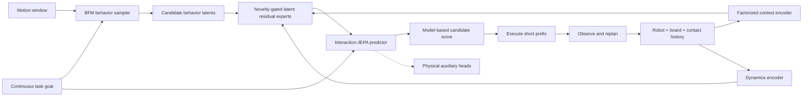

# Skate-BFM

**Predictive Behavior Foundation Models for Humanoid Interaction with
Underactuated Moving Supports**

Skate-BFM is a research framework for combining BFM-Zero humanoid behavior
priors with the HUSKY skateboard simulator. The project studies closed-loop
humanoid interaction with a freely rolling, underactuated support, including
mounting, riding, steering, recovery, and safe departure.

The repository provides the BFM0-HUSKY integration and two matched H1
experiments for measuring the motion capacity of a frozen official BFM-Zero
model. `without_prior` performs goal-directed retrieval for skateboard motion
targets using a global latent scan followed by broad CEM; expert data defines
the targets, initial states, and scores but never proposes a latent.
`with_prior` reconstructs official backward observations and executes
time-aligned expert latent trajectories, followed by trajectory-local CEM.
These are short-horizon behavior-coverage experiments, not a trained
Skate-BFM policy or a complete skateboarding controller.

## Setup

Clone the repository with the pinned HUSKY submodule:

```bash
git clone --recurse-submodules https://github.com/RL2-skateboard/Skate-BFM.git
cd Skate-BFM
```

If the repository has already been cloned, initialize the submodule manually:

```bash
git submodule update --init --recursive
```

Create the supported Conda environment:

```bash
bash scripts/setup_env.sh
conda activate skatebfm
```

The setup script installs the root package and the lightweight HUSKY runtime.
The configured environment uses Python 3.12, PyTorch, CUDA, and MuJoCo.

Verify the installation:

```bash
python -c "import torch, mujoco; print(torch.__version__, torch.cuda.is_available(), mujoco.__version__)"
```

## Official BFM-Zero Model

Keep all local BFM-Zero source and checkpoints under the ignored `model/`
directory:

```text
model/
├── bfm-zero-source/        # LeCAR-Lab/BFM-Zero at revision 318cf44
└── bfm-zero-official/      # config.json, init_kwargs.json, model.safetensors
```

The formal checkpoint is the `LeCAR-Lab/BFM-Zero` Hugging Face bundle at
revision `62b4206d68e026de5e5dc7efb1529bccfb95164c`. Its
`model.safetensors` SHA-256 is
`33f410c190877a1348dc3fafa3f0e97b277ad0251b39615ff98e5bd26369e361`.
Model files are intentionally excluded from Git because the checkpoint is
3.38 GB.

## Tests

Run all development checks:

```bash
ruff check src tests husky_sim/src
pytest -v
```

Test the BFM0 model interface:

```bash
pytest tests/test_bfm0.py -v
```

Test the BFM0-to-HUSKY action and observation adapters:

```bash
pytest tests/test_integration.py tests/test_observations.py -v
```

Run the end-to-end headless MuJoCo smoke test:

```bash
skate-bfm-smoke --steps 20
```

Open the integrated BFM0-HUSKY MuJoCo viewer:

```bash
skate-bfm-smoke --viewer --steps 0
```

Close the MuJoCo window to stop the continuous run. For a short visual check,
replace `--steps 0` with a finite value such as `--steps 300`.
Use the mouse to rotate, pan, and zoom the MuJoCo camera.

The smoke test verifies that the BFM0 interface, 29DoF-to-23DoF adapter, HUSKY
scene, and MuJoCo stepping loop work together. It is a software validation
command, not a skateboarding experiment or task-performance result.

The viewer keeps `--action-gain 0.0` by default because the repository does not
load the official BFM-Zero checkpoint through this lightweight diagnostic
command. A nonzero value applies the compact untrained interface output and is
intended only for adapter diagnostics:

```bash
skate-bfm-smoke --viewer --steps 300 --action-gain 0.05
```

## H1 Formal Experiments

Run the global search without an expert latent prior:

```bash
BFM_ZERO_ROOT="$PWD/model/bfm-zero-source" \
skate-bfm-h1 \
  --config configs/h1_bfm_coverage.yaml \
  --checkpoint model/bfm-zero-official \
  --run-type formal \
  --experiment-name h1_bfm0_motion_without_prior \
  --prior-mode without_prior \
  --device cuda \
  --save-video
```

Run the time-aligned search with an expert latent prior:

```bash
BFM_ZERO_ROOT="$PWD/model/bfm-zero-source" \
skate-bfm-h1 \
  --config configs/h1_bfm_coverage.yaml \
  --checkpoint model/bfm-zero-official \
  --run-type formal \
  --experiment-name h1_bfm0_motion_with_prior \
  --prior-mode with_prior \
  --device cuda \
  --save-video
```

Both completed runs are compared in [`docs/exp_res.md`](docs/exp_res.md).
Their structured results, four latent-space plots, and content-named MuJoCo
videos are stored under [`docs/res/`](docs/res/). Smoke runs use a temporary
directory and are deleted automatically; they do not update either experiment
document.

H1 reconstructs the official 64-dimensional state and 463-dimensional
privileged state from confirmed expert fields. Static poses use 29DoF IK and
zero target velocity; dynamic windows use root and 29DoF trajectories with
50 Hz finite-difference velocities. The frozen official backward map produces
`z_t` from each next-frame expert observation, matching the official tracking
evaluator. In `with_prior`, dynamic CEM perturbs the complete latent trajectory
with temporally correlated noise and constrains every step to a 40-degree
spherical neighborhood. In `without_prior`, each target scores 256 random
constant-latent directions before broad CEM refinement from that target's
global best. A positive retrieval is evidence that a matching short-horizon
meta-action exists in the tested frozen model; an unsuccessful finite search
does not prove that no matching latent exists. Each dynamic rollout starts
from its own expert window's first qpos and qvel. Because the motion files do
not contain synchronized skateboard state, global translation is removed,
foot heading is aligned with the board length, and the lowest foot is placed
on the deck.

## Current Framework

- A compact forward-backward BFM0 model interface with 256-dimensional behavior
  latents and 29-dimensional G1 actions.
- A name-based adapter from BFM0 G1-29DoF actions to HUSKY G1-23DoF actions.
- HUSKY source, assets, reference data, and MJLab training code pinned under
  `husky_sim/upstream/`.
- A project-owned lightweight HUSKY MuJoCo runtime under
  `husky_sim/src/skate_husky/`.
- A strict adapter for the official pretrained BFM-Zero checkpoint.
- Expert-pose and expert-motion reconstruction for official backward-map goal
  latents and time-aligned latent trajectories.
- The matched without-prior and with-prior H1 searches, metrics, plots, and
  videos.
- Unit tests and an end-to-end headless smoke command.

The six BFM0 wrist joints absent from the HUSKY G1-23DoF model are explicitly
dropped by the action adapter. Official BFM-Zero checkpoints remain local,
ignored artifacts under `model/`.

## Repository Layout

```text
Skate-BFM/
├── configs/                 # Baseline experiment configuration
├── docs/                    # Experiment log and formal results
├── husky_sim/
│   ├── src/skate_husky/     # Lightweight project runtime
│   └── upstream/            # Pinned official HUSKY submodule
├── model/                    # Ignored local source and model checkpoints
├── scripts/                 # Environment setup
├── src/skate_bfm/
│   ├── bfm0/                # BFM0 model interface
│   ├── exp/                  # Formal experiments
│   └── integration/         # Action and observation adapters
└── tests/                   # Development tests
```

## Research Direction

BFM-Zero provides a general humanoid motion prior, but its behavior latent does
not guarantee that a motion is executable on a freely rolling skateboard.
Skate-BFM uses BFM0 as a short-horizon behavior sampler and plans to condition
prediction on the coupled robot-board-contact state.



## Experiment Records

- [`docs/exp_logs.md`](docs/exp_logs.md): brief dated development log.
- [`docs/exp_res.md`](docs/exp_res.md): formal experiment parameters and
  results, plots, and videos.

## Upstream Projects

- [LeCAR-Lab/BFM-Zero](https://github.com/LeCAR-Lab/BFM-Zero), revision
  `318cf44a3262e5bdec5944f82f1a5f509b95d09b`.
- [TeleHuman/humanoid_skateboarding](https://github.com/TeleHuman/humanoid_skateboarding),
  revision `d93833e80deff7f927c0b80ef9c435d8b5c488fe`.
- [AnonChongqing/Skate-bfm](https://github.com/AnonChongqing/Skate-bfm),
  consulted as the earlier integration experiment.

BFM-Zero and HUSKY are released under CC BY-NC 4.0. Their use and attribution
requirements apply to the corresponding code and assets. This repository is
for non-commercial research and is distributed under
[`CC BY-NC 4.0`](LICENSE).
