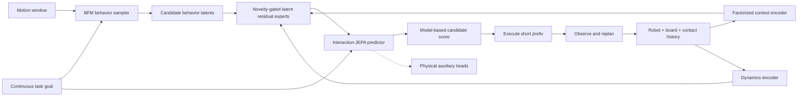

# Skate-BFM

**Predictive Behavior Foundation Models for Humanoid Interaction with
Underactuated Moving Supports**

Skate-BFM studies how a general humanoid behavior foundation model can predict,
select, and locally correct short-horizon behaviors while interacting with a
freely rolling, underactuated skateboard. The goal is not to reproduce one
recorded skateboarding motion. The goal is a closed-loop model that can generate
physically feasible mounting, riding, steering, recovery, and safe-departure
behaviors under unknown board dynamics and mixed contact conditions.



## Research Hypothesis

BFM-Zero provides a strong prior over general humanoid motion, but its behavior
latent primarily describes how the robot moves and does not guarantee that the
motion is executable on a freely rolling, underactuated support. Skate-BFM uses
BFM0 as a short-horizon behavior sampler, conditions prediction on the coupled
robot-board-contact state, and applies novelty-gated latent residual experts.
Rolling prediction and behavior selection turn the general motion prior into a
closed-loop interaction policy for moving supports.

The planned system has seven components:

1. BFM behavior-window sampling.
2. Factorized robot, board, and contact state encoding.
3. A skateboard-dynamics latent.
4. Novelty-gated latent residual experts.
5. Interaction-JEPA prediction at multiple horizons.
6. Prediction-defined interaction-region discovery.
7. Rolling behavior selection and replanning.

## Current Baseline

The initial baseline establishes the integration boundary:

- a compact forward-backward BFM0 model interface with 256-dimensional behavior
  latents and 29-dimensional G1 actions;
- a name-based adapter from BFM0 G1-29DoF actions to HUSKY G1-23DoF actions,
  explicitly dropping the six wrist joints absent from HUSKY;
- the official HUSKY MJLab source, assets, reference data, and generated MuJoCo
  scene pinned as a submodule under `husky_sim/upstream/`;
- a headless MuJoCo smoke rollout that validates model loading, observation
  conversion, action mapping, and simulator stepping.

This baseline does **not** include a trained Skate-BFM policy or claim successful
skateboarding. Official BFM-Zero checkpoints and larger datasets remain external
artifacts.

## Repository Layout

```text
Skate-BFM/
├── configs/                 # Reproducible experiment configuration
├── docs/                    # Experiment log and results
├── husky_sim/               # HUSKY runtime and pinned upstream submodule
├── scripts/                 # Environment setup
├── src/skate_bfm/
│   ├── bfm0/                # Minimal forward-backward model interface
│   └── integration/         # Observation and 29DoF-to-23DoF adapters
└── tests/                   # Model and integration tests
```

## Setup

The supported environment is named `skatebfm`:

```bash
bash scripts/setup_env.sh
conda activate skatebfm
```

Run the unit tests and the end-to-end headless smoke rollout:

```bash
pytest
skate-bfm-smoke --steps 20
```

The complete HUSKY training stack has additional CUDA and MJLab requirements.
See the
[`TeleHuman/humanoid_skateboarding`](https://github.com/TeleHuman/humanoid_skateboarding)
repository for upstream training and policy-play commands.

## Experiment Records

- [`docs/exp_logs.md`](docs/exp_logs.md): dated implementation log.
- [`docs/exp_res.md`](docs/exp_res.md): parameters, validation results, and
  research figures.

## Upstream Projects

- [LeCAR-Lab/BFM-Zero](https://github.com/LeCAR-Lab/BFM-Zero), revision
  `318cf44a3262e5bdec5944f82f1a5f509b95d09b`.
- [TeleHuman/humanoid_skateboarding](https://github.com/TeleHuman/humanoid_skateboarding),
  revision `d93833e80deff7f927c0b80ef9c435d8b5c488fe`.
- [AnonChongqing/Skate-bfm](https://github.com/AnonChongqing/Skate-bfm),
  consulted as the earlier integration experiment.

BFM-Zero and HUSKY are released under CC BY-NC 4.0. Their use and attribution
requirements apply to the corresponding code and assets. This repository is
for non-commercial research and is distributed under
[`CC BY-NC 4.0`](LICENSE).
