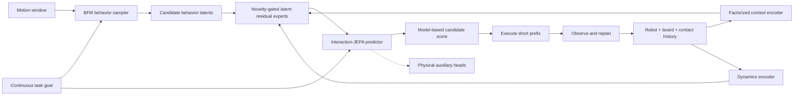

# Skate-BFM

**Predictive Behavior Foundation Models for Humanoid Interaction with
Underactuated Moving Supports**

Skate-BFM is a research framework for combining BFM-Zero humanoid behavior
priors with the HUSKY skateboard simulator. The project studies closed-loop
humanoid interaction with a freely rolling, underactuated support, including
mounting, riding, steering, recovery, and safe departure.

The current repository provides the initial BFM0-HUSKY integration framework.
It does not yet include a trained Skate-BFM policy or formal experiment results.

## Setup

Clone the repository with the pinned HUSKY submodule:

```bash
git clone --recurse-submodules https://github.com/RL2-skateboard/Skate-BFM.git
cd Skate-BFM
```

If the repository has already been cloned, initialize the submodule manually:

```bash
git submodule update --init --recursive
```

Create the supported Conda environment:

```bash
bash scripts/setup_env.sh
conda activate skatebfm
```

The setup script installs the root package and the lightweight HUSKY runtime.
The configured environment uses Python 3.12, PyTorch, CUDA, and MuJoCo.

Verify the installation:

```bash
python -c "import torch, mujoco; print(torch.__version__, torch.cuda.is_available(), mujoco.__version__)"
```

## Tests

Run all development checks:

```bash
ruff check src tests husky_sim/src
pytest -v
```

Test the BFM0 model interface:

```bash
pytest tests/test_bfm0.py -v
```

Test the BFM0-to-HUSKY action and observation adapters:

```bash
pytest tests/test_integration.py tests/test_observations.py -v
```

Run the end-to-end headless MuJoCo smoke test:

```bash
skate-bfm-smoke --steps 20
```

The smoke test verifies that the BFM0 interface, 29DoF-to-23DoF adapter, HUSKY
scene, and MuJoCo stepping loop work together. It is a software validation
command, not a skateboarding experiment or task-performance result.

## Current Framework

- A compact forward-backward BFM0 model interface with 256-dimensional behavior
  latents and 29-dimensional G1 actions.
- A name-based adapter from BFM0 G1-29DoF actions to HUSKY G1-23DoF actions.
- HUSKY source, assets, reference data, and MJLab training code pinned under
  `husky_sim/upstream/`.
- A project-owned lightweight HUSKY MuJoCo runtime under
  `husky_sim/src/skate_husky/`.
- Unit tests and an end-to-end headless smoke command.

The six BFM0 wrist joints absent from the HUSKY G1-23DoF model are explicitly
dropped by the action adapter. Official BFM-Zero checkpoints and larger training
datasets remain external artifacts.

## Repository Layout

```text
Skate-BFM/
├── configs/                 # Baseline experiment configuration
├── docs/                    # Experiment log and formal results
├── husky_sim/
│   ├── src/skate_husky/     # Lightweight project runtime
│   └── upstream/            # Pinned official HUSKY submodule
├── scripts/                 # Environment setup
├── src/skate_bfm/
│   ├── bfm0/                # BFM0 model interface
│   └── integration/         # Action and observation adapters
└── tests/                   # Development tests
```

## Research Direction

BFM-Zero provides a general humanoid motion prior, but its behavior latent does
not guarantee that a motion is executable on a freely rolling skateboard.
Skate-BFM uses BFM0 as a short-horizon behavior sampler and plans to condition
prediction on the coupled robot-board-contact state.



## Experiment Records

- [`docs/exp_logs.md`](docs/exp_logs.md): brief dated development log.
- [`docs/exp_res.md`](docs/exp_res.md): formal experiment parameters and
  results. It remains empty until the first experiment is completed.

## Upstream Projects

- [LeCAR-Lab/BFM-Zero](https://github.com/LeCAR-Lab/BFM-Zero), revision
  `318cf44a3262e5bdec5944f82f1a5f509b95d09b`.
- [TeleHuman/humanoid_skateboarding](https://github.com/TeleHuman/humanoid_skateboarding),
  revision `d93833e80deff7f927c0b80ef9c435d8b5c488fe`.
- [AnonChongqing/Skate-bfm](https://github.com/AnonChongqing/Skate-bfm),
  consulted as the earlier integration experiment.

BFM-Zero and HUSKY are released under CC BY-NC 4.0. Their use and attribution
requirements apply to the corresponding code and assets. This repository is
for non-commercial research and is distributed under
[`CC BY-NC 4.0`](LICENSE).
