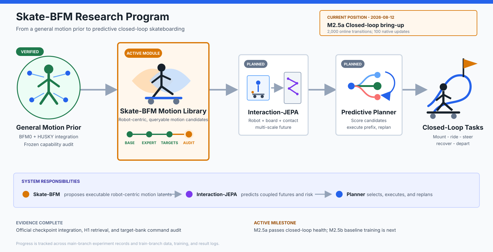
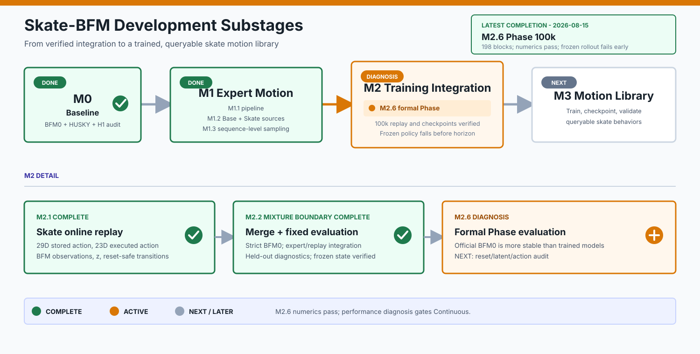
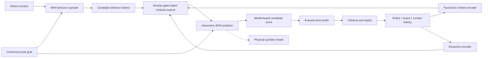

# Skate-BFM

**Predictive Behavior Foundation Models for Humanoid Interaction with
Underactuated Moving Supports**

Skate-BFM is a research framework for combining BFM-Zero humanoid behavior
priors with the HUSKY skateboard simulator. The project studies closed-loop
humanoid interaction with a freely rolling, underactuated support, including
mounting, riding, steering, recovery, and safe departure.

## Engineering Progress



### Current Development Substage



**Status as of 2026-08-11:** the official BFM0-HUSKY foundation and matched
frozen-BFM0 capability audit are complete. Base and Skate expert sources,
M2.1 Skate online replay, and M2.2a official BFM0 initialization plus
expert/replay merge are complete. M2.2b-1 enabled and validated the first
controlled F/B-only Skate adaptation boundary. M2.2b-2 completed evaluator
fidelity and clean-process reproducibility auditing. M2.2b-3 completed the
auditable Base+Skate 50/50 expert-mixture boundary experiment at independent
1/10/100 update milestones. Its representation metrics are mixed at 1/10 and
favorable at 100, so it is not yet a downstream task-success claim. M2.3a-0
audited the target bank and command alignment, and M2.3b-0 completed the
evaluation-only frozen-Actor target-conditioned preflight: the forward-push
target has a consistent forward-response advantage over matched random
latents, but lateral and heading behavior remain mixed. Full FB-CPR-Aux
training has not started. Interaction-JEPA, predictive closed-loop planning,
and complete skateboarding-task evaluation remain later project modules.

This section is the project-level progress snapshot. Update the date, current
stage, image, and branch-specific records together whenever a milestone changes.
Training details belong in [`train/train_log.md`](train/train_log.md) and
[`train/train_res.md`](train/train_res.md); formal H1 records remain on `main`.

The current M2.2b-3 treatment can be reproduced with the vendored training
entrypoint after the official checkpoint and Skate artifact are available:

```bash
for updates in 1 10 100; do
  SKATE_ONLINE_ENV=skate \
  SKATE_UPDATE_MODE=fb_only \
  SKATE_ADAPTATION_UPDATES=$updates \
  SKATE_MAX_STEPS=1024 \
  SKATE_EXPERT_RATIO=0.5 \
  SKATE_EXPERT_MOTION_FILE=$PWD/train/dataset/skate-expert-pose/motion_library/skate_expert.pkl \
  SKATE_WORK_DIR=$PWD/results/m2.2b-3/base_skate_50_50/update_$updates \
  CUDA_VISIBLE_DEVICES=0 \
  python train/scripts/train_skate_bfm.py
done
```

Evaluate one produced checkpoint with the fixed protocol:

```bash
CUDA_VISIBLE_DEVICES=0 python train/scripts/evaluate_skate_bfm.py \
  --checkpoint results/m2.2b-3/base_skate_50_50/update_100/checkpoint \
  --output-dir results/m2.2b-3/base_skate_50_50/eval_100
```

Run the M2.3b-0 frozen-Actor target-conditioned preflight:

```bash
CUDA_VISIBLE_DEVICES=0 python train/scripts/evaluate_skate_target_conditioned.py \
  --output-dir results/m2.3b-0-target-conditioned
```

This is evaluation-only: it uses `skate_target_00`, four fixed random latent
controls, the four fixed seen/unseen dynamics conditions, and 128-step
canonical-reset rollouts for each of the three frozen checkpoints. It performs
no training, optimizer step, backward call, replay update, or command
injection. The generated JSON result is kept under the ignored `results/`
directory; the summarized tables and boundary checks are recorded in
[`train/train_res.md`](train/train_res.md).

Audit the current expert target bank without training or rollout:

```bash
CUDA_VISIBLE_DEVICES=0 python train/scripts/audit_skate_target_bank.py \
  --raw-rollout /absolute/path/to/raw_rollout.npz
```

The audit writes
`train/dataset/skate-expert-pose/target_bank/target_bank.json`. It uses
8-frame windows, raw HUSKY physical state for labels, and the existing
`encode_expert()` latent equations only for inference diagnostics.

This `train` branch is reserved for model training, dataset preparation,
checkpoint management, and learned motion-library development. The `main`
branch remains the reference branch for the BFM0-HUSKY integration and formal
H1 evaluation. This branch does not retain the formal experiment documents
from `main`; training progress is recorded in
[`train/train_log.md`](train/train_log.md), and training results are recorded
in [`train/train_res.md`](train/train_res.md).

## Setup

Clone the repository with the pinned HUSKY submodule:

```bash
git clone --recurse-submodules https://github.com/RL2-skateboard/Skate-BFM.git
cd Skate-BFM
```

If the repository has already been cloned, initialize the submodule manually:

```bash
git submodule update --init --recursive
```

Create the supported Conda environment:

```bash
bash scripts/setup_env.sh
conda activate skatebfm
```

The setup script installs the root package and the lightweight HUSKY runtime.
The configured environment uses Python 3.12, PyTorch, CUDA, and MuJoCo.

Verify the installation:

```bash
python -c "import torch, mujoco; print(torch.__version__, torch.cuda.is_available(), mujoco.__version__)"
```

## Official BFM-Zero Runtime And Model

The BFM-Zero Isaac/HumanoidVerse runtime is vendored under the tracked training
scripts, while the large checkpoint remains under the ignored `model/`
directory:

```text
train/scripts/isaac_env/    # LeCAR-Lab/BFM-Zero runtime at revision 318cf44
model/bfm-zero-official/    # config.json, init_kwargs.json, model.safetensors
```

The formal checkpoint is the `LeCAR-Lab/BFM-Zero` Hugging Face bundle at
revision `62b4206d68e026de5e5dc7efb1529bccfb95164c`. Its
`model.safetensors` SHA-256 is
`33f410c190877a1348dc3fafa3f0e97b277ad0251b39615ff98e5bd26369e361`.
Model files are intentionally excluded from Git because the checkpoint is
3.38 GB.

## Tests

Run all development checks:

```bash
ruff check src tests husky_sim/src
pytest -v
```

Test the BFM0 model interface:

```bash
pytest tests/test_bfm0.py -v
```

Test the BFM0-to-HUSKY action and observation adapters:

```bash
pytest tests/test_integration.py tests/test_observations.py -v
```

Run the end-to-end headless MuJoCo smoke test:

```bash
skate-bfm-smoke --steps 20
```

Open the integrated BFM0-HUSKY MuJoCo viewer:

```bash
skate-bfm-smoke --viewer --steps 0
```

Close the MuJoCo window to stop the continuous run. For a short visual check,
replace `--steps 0` with a finite value such as `--steps 300`.
Use the mouse to rotate, pan, and zoom the MuJoCo camera.

The smoke test verifies that the BFM0 interface, 29DoF-to-23DoF adapter, HUSKY
scene, and MuJoCo stepping loop work together. It is a software validation
command, not a skateboarding experiment or task-performance result.

The viewer keeps `--action-gain 0.0` by default because the repository does not
load the official BFM-Zero checkpoint through this lightweight diagnostic
command. A nonzero value applies the compact untrained interface output and is
intended only for adapter diagnostics:

```bash
skate-bfm-smoke --viewer --steps 300 --action-gain 0.05
```

## H1 Formal Experiments

Run the global search without an expert latent prior:

```bash
BFM_ZERO_ROOT="$PWD/train/scripts/isaac_env" \
skate-bfm-h1 \
  --config configs/h1_bfm_coverage.yaml \
  --checkpoint model/bfm-zero-official \
  --run-type formal \
  --experiment-name h1_bfm0_motion_without_prior \
  --prior-mode without_prior \
  --device cuda \
  --save-video
```

Run the time-aligned search with an expert latent prior:

```bash
BFM_ZERO_ROOT="$PWD/train/scripts/isaac_env" \
skate-bfm-h1 \
  --config configs/h1_bfm_coverage.yaml \
  --checkpoint model/bfm-zero-official \
  --run-type formal \
  --experiment-name h1_bfm0_motion_with_prior \
  --prior-mode with_prior \
  --device cuda \
  --save-video
```

Formal H1 records and videos are maintained on the `main` branch. Training
checkpoints and motion-library outputs for this branch belong under the
ignored [`model/motion_library/`](model/motion_library/) directory.

H1 reconstructs the official 64-dimensional state and 463-dimensional
privileged state from confirmed expert fields. Static poses use 29DoF IK and
zero target velocity; dynamic windows use root and 29DoF trajectories with
50 Hz finite-difference velocities. The frozen official backward map produces
`z_t` from each next-frame expert observation, matching the official tracking
evaluator. In `with_prior`, dynamic CEM perturbs the complete latent trajectory
with temporally correlated noise and constrains every step to a 40-degree
spherical neighborhood. In `without_prior`, each target scores 256 random
constant-latent directions before broad CEM refinement from that target's
global best. A positive retrieval is evidence that a matching short-horizon
meta-action exists in the tested frozen model; an unsuccessful finite search
does not prove that no matching latent exists. Each dynamic rollout starts
from its own expert window's first qpos and qvel. Because the motion files do
not contain synchronized skateboard state, the complete root trajectory is
rigidly aligned to the static push reference: the right support foot is placed
on the deck, while the left push foot keeps its expert-relative distance and
height so it remains on the ground or in its swing phase.

## Current Framework

- A compact forward-backward BFM0 model interface with 256-dimensional behavior
  latents and 29-dimensional G1 actions.
- A name-based adapter from BFM0 G1-29DoF actions to HUSKY G1-23DoF actions.
- HUSKY source, assets, reference data, and MJLab training code pinned under
  `husky_sim/upstream/`.
- A project-owned lightweight HUSKY MuJoCo runtime under
  `husky_sim/src/skate_husky/`.
- A strict adapter for the official pretrained BFM-Zero checkpoint.
- Expert-pose and expert-motion reconstruction for official backward-map goal
  latents and time-aligned latent trajectories.
- The matched without-prior and with-prior H1 searches, metrics, plots, and
  videos.
- Unit tests and an end-to-end headless smoke command.

The six BFM0 wrist joints absent from the HUSKY G1-23DoF model are explicitly
dropped by the action adapter. Official BFM-Zero checkpoints remain local,
ignored artifacts under `model/`.

## Repository Layout

```text
Skate-BFM/
├── configs/                 # Baseline experiment configuration
├── husky_sim/
│   ├── src/skate_husky/     # Lightweight project runtime
│   └── upstream/            # Pinned official HUSKY submodule
├── model/
│   └── motion_library/       # Ignored trained motion-library outputs
├── scripts/                 # Environment setup
├── src/skate_bfm/
│   ├── bfm0/                # BFM0 model interface
│   ├── exp/                  # Formal experiments
│   └── integration/         # Action and observation adapters
├── tests/                   # Development tests
└── train/
    ├── dataset/             # Local training and preprocessing data
    ├── train_log.md         # Dated training-development log
    └── train_res.md         # Training parameters and results
```

## Research Direction

BFM-Zero provides a general humanoid motion prior, but its behavior latent does
not guarantee that a motion is executable on a freely rolling skateboard.
Skate-BFM uses BFM0 as a short-horizon behavior sampler and plans to condition
prediction on the coupled robot-board-contact state.



## Training Records

- [`train/train_log.md`](train/train_log.md): brief dated training log.
- [`train/train_res.md`](train/train_res.md): training parameters and results.

## Upstream Projects

- [LeCAR-Lab/BFM-Zero](https://github.com/LeCAR-Lab/BFM-Zero), revision
  `318cf44a3262e5bdec5944f82f1a5f509b95d09b`.
- [TeleHuman/humanoid_skateboarding](https://github.com/TeleHuman/humanoid_skateboarding),
  revision `d93833e80deff7f927c0b80ef9c435d8b5c488fe`.
- [AnonChongqing/Skate-bfm](https://github.com/AnonChongqing/Skate-bfm),
  consulted as the earlier integration experiment.

BFM-Zero and HUSKY are released under CC BY-NC 4.0. Their use and attribution
requirements apply to the corresponding code and assets. This repository is
for non-commercial research and is distributed under
[`CC BY-NC 4.0`](LICENSE).
