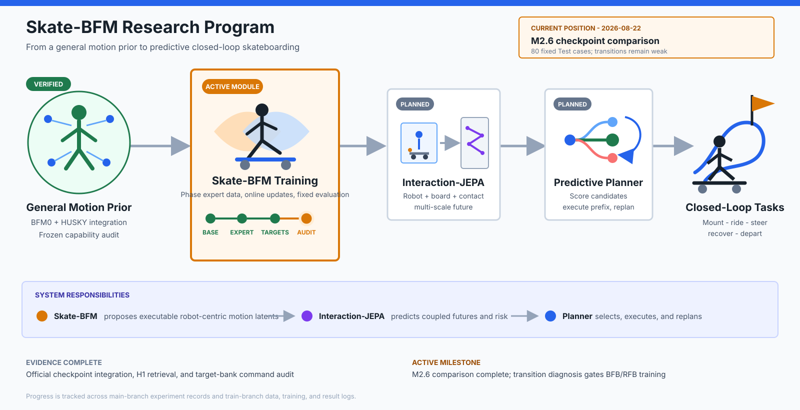
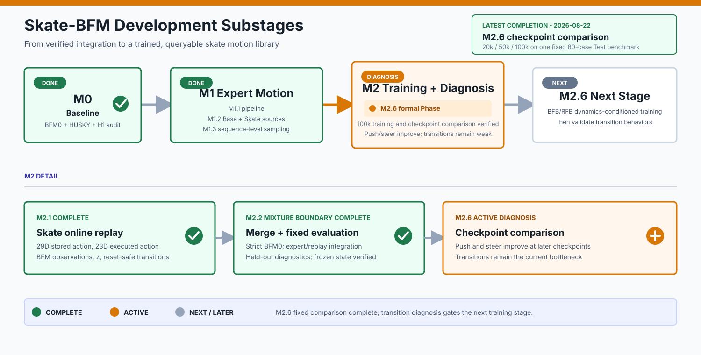

# Skate-BFM

Skate-BFM adapts the official BFM-Zero motion prior to one HUSKY MuJoCo
skateboard environment. The current repository has completed the formal M2.6
Phase 100k run and a frozen 20k/50k/100k checkpoint comparison on one fixed
80-case Test benchmark, including MuJoCo videos and latent-space diagnostics.





## Current Status

- Online training environment: four independent nominal HUSKY MuJoCo
  environments.
- Action contract: 29D BFM action stored in replay; 23D name-mapped HUSKY
  action executed in simulation.
- Expert batch: 1024 rows = 64 Base sequences + 64 Skate sequences, each of
  length 8.
- Initialization: fresh official BFM0 checkpoint, verified against SHA256
  `33f410c190877a1348dc3fafa3f0e97b277ad0251b39615ff98e5bd26369e361`.
- Training: 100,000 online transitions and 9,900 native
  `FBcprAuxAgent.update()` calls. Updates begin at step 1,500 and run every
  500 transitions for 50 updates per block.
- Reset: uniform expert motion and local frame sampling, followed by direct
  raw HUSKY robot-board `qpos/qvel` injection.
- Latent lifecycle: expert rollout slots use reset-aligned tracking latents;
  background latents refresh every 100 transitions from the z-buffer or the
  official prior sampler.
- Physics: formal training restores the selected source rollout's physics
  realization; no additional online physics randomization is applied.
- Checkpoints: `20k`, `50k`, and `100k`, stored under
  `model/motion_library/m2.6-p1-phase-100k-seed4728/`.
- Published checkpoint:
  [`m2.6-phase-100k-seed4728`](https://huggingface.co/Yak9Ce3teeh/skate-bfm/tree/main/motion_library/m2.6-phase-100k-seed4728).

Training and checkpoint integrity passed: replay size, optimizer state,
normalizers, model finiteness, and checkpoint reloads are valid. The current
80-case frozen comparison shows that `push` and `steer` improve at later
checkpoints, while `push2steer` and `steer2push` remain weak transition
behaviors. Further training is paused while the transition semantics and the
planned dynamics-conditioned BFB/RFB stage are addressed.

## Setup

Clone the training branch with submodules:

```bash
git clone --branch train --recurse-submodules \
  https://github.com/RL2-skateboard/Skate-BFM.git
cd Skate-BFM
```

For an existing clone:

```bash
git checkout train
git pull --ff-only origin train
git submodule update --init --recursive
```

Create the supported environment and install the project plus its MotionLib
dependencies:

```bash
conda env create -f environment.yml
conda activate skatebfm
pip install -e '.[dev,motionlib]'
```

The official BFM0 checkpoint must be restored separately at:

```text
model/bfm-zero-official/
```

All training data is read from `train/dataset/`. Download the formal Skate
datasets from the
[Skate-BFM Hugging Face dataset](https://huggingface.co/datasets/Yak9Ce3teeh/skate-sim-dataset):

```bash
hf download Yak9Ce3teeh/skate-sim-dataset \
  --repo-type dataset \
  --include "train/raw/**" "train/phase/**" \
  --local-dir train/dataset/sim_collected
```

Replace `train/phase/**` with `train/continuous/**` to use the Continuous
MotionLib; keep `train/raw/**` because training resets require the source
robot-board states. `val/` and `test/` are source-disjoint held-out splits for
evaluation and must not be included by formal training.
Restore the official BFM-Zero Base/LAFAN training file:

```bash
mkdir -p train/dataset/base
curl -L \
  https://media.githubusercontent.com/media/LeCAR-Lab/BFM-Zero/main/humanoidverse/data/lafan_29dof_10s-clipped.pkl \
  -o train/dataset/base/lafan_29dof_10s-clipped.pkl
```

The expected Base/LAFAN SHA256 is
`7f5aa36957808ee2e972472b18add8510533742710ba312d8b8c6e6014f1c010`.
`train/scripts/isaac_env/` is the vendored BFM-Zero runtime used by the
official agent and MotionLib interfaces; `husky_sim/` is the project-owned
HUSKY runtime boundary.

## Build Phase Expert Data

The production collector writes complete, frame-aligned robot-board rollouts.
The dataset processor scans every raw rollout, uses recorded phase IDs for
strict contiguous segmentation, aggregates all accepted motions, validates the
result with official BFM interfaces, and can generate post-hoc full-scene QC:

The formal dataset uses source-disjoint `train/`, `val/`, and `test/` roots.
Each root contains `raw/`, `phase/`, and `continuous/`. Formal training reads
only [train/](https://huggingface.co/datasets/Yak9Ce3teeh/skate-sim-dataset/tree/main/train);
Validation supports model selection and Test is reserved for final held-out
reporting. Restore Train raw data with:

```bash
hf download Yak9Ce3teeh/skate-sim-dataset \
  --repo-type dataset \
  --include "train/raw/**" \
  --local-dir train/dataset/sim_collected
```

Restore Train Phase artifacts with:

```bash
hf download Yak9Ce3teeh/skate-sim-dataset \
  --repo-type dataset \
  --include "train/phase/**" \
  --local-dir train/dataset/sim_collected
```

```bash
python train/scripts/data_collection/convert_phase.py \
  --aggregate-phase \
  --dataset-root train/dataset/sim_collected/train \
  --dataset-split train \
  --bfm-repo train/scripts/isaac_env \
  --bfm-reference train/dataset/base/lafan_29dof_10s-clipped.pkl \
  --robot-xml train/scripts/isaac_env/humanoidverse/data/robots/g1/g1_29dof.xml \
  --husky-xml husky_sim/upstream/test_scene/mjlab_scene.xml \
  --output train/dataset/sim_collected/train/phase/motion_library/skate_expert_phase.pkl \
  --manifest train/dataset/sim_collected/train/phase/motion_library/manifest.json \
  --qc-root train/dataset/sim_collected/train/phase/qc \
  --validate-motionlib
```

Phase datasets use `convert_phase.py`; fixed-window continuous datasets use
`convert_continuous.py`. Both consume the same canonical raw collection.

The Train Continuous dataset is published under
[train/continuous/](https://huggingface.co/datasets/Yak9Ce3teeh/skate-sim-dataset/tree/main/train/continuous).
Restore it with:

```bash
hf download Yak9Ce3teeh/skate-sim-dataset \
  --repo-type dataset \
  --include "train/continuous/**" \
  --local-dir train/dataset/sim_collected
```

The six absent HUSKY wrist joints are explicitly fixed to zero. Each accepted
record retains board state, action, phase annotations, and source provenance.
The converter rejects malformed arrays, cross-boundary motions, incomplete
sequences, and invalid BFM schemas.

## Train

Use a new work directory for each run:

```bash
python train/scripts/train_skate_bfm.py \
  --dataset phase \
  --max-steps 100000 \
  --online-envs 4 \
  --seed 4728 \
  --work-dir results/m2.6-phase-100k-seed4728-v2 \
  --checkpoint-dir model/motion_library/m2.6-phase-100k-seed4728-v2 \
  --pretrained-checkpoint model/bfm-zero-official
```

The formal entrypoint uses the 100k schedule and 50/50 expert mixture. Each
run must use a unique `<model_name>` under `model/motion_library/`, selected
with `--checkpoint-dir`. The entrypoint fails closed when the output already
exists or when the checkpoint, data, replay schema, optimizer state, or reload
contract is invalid.

## Evaluate

Restore the published diagnostic checkpoint:

```bash
hf download Yak9Ce3teeh/skate-bfm \
  --include "motion_library/m2.6-phase-100k-seed4728/**" \
  --local-dir model
```

Evaluate one frozen formal checkpoint with the same expert-reset and latent
lifecycle used by online training. Add `--video` to save one offscreen MP4 and
`--viewer` for the realtime MuJoCo window:

```bash
python train/scripts/evaluator.py \
  --checkpoint model/motion_library/m2.6-phase-100k-seed4728/checkpoint_100000 \
  --dataset phase \
  --episodes 4 \
  --video results/frozen_rollout.mp4 \
  --viewer
```

The historical official/10k/20k target-conditioned protocol remains available
through `--mode fixed-target`.

## Layout

```text
train/scripts/train_skate_bfm.py  formal training entrypoint
train/scripts/train_runner.py     shared runtime and checkpoint integrity
train/scripts/evaluator.py         frozen rollout and fixed-target evaluator
train/scripts/data_collection/    HUSKY expert-motion conversion
train/scripts/isaac_env/          vendored BFM-Zero runtime
train/dataset/base/               official Base/LAFAN training motion
train/dataset/sim_collected/      raw, Phase, and Continuous Skate data
husky_sim/src/skate_husky/        HUSKY MuJoCo runtime and physical contracts
src/skate_bfm/integration/        BFM action/observation/replay adapters
```

Detailed current records are in [train/train_log.md](train/train_log.md) and
[train/train_res.md](train/train_res.md).
