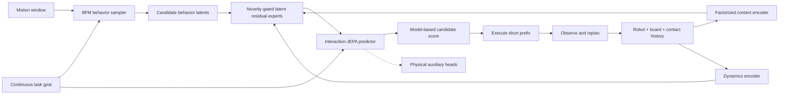

# Experiment Results

## Baseline: BFM0 + HUSKY Integration

**Date:** 2026-07-30

### Objective

Establish a reproducible software boundary between a BFM0-style 29DoF humanoid
behavior policy and the HUSKY 23DoF skateboard simulator before training any
skateboard-aware behavior model.

### Parameters

| Parameter | Value |
| --- | --- |
| Random seed | `42` |
| Python | `3.12.13` |
| PyTorch / CUDA | `2.5.1 / 12.4` |
| MuJoCo | `3.11.0` |
| BFM0 state dimension | `64` |
| BFM0 history dimension | `372` |
| BFM0 action dimension | `29` |
| Behavior latent dimension | `256` |
| HUSKY action dimension | `23` |
| History length | `4` |
| MuJoCo simulation step | `0.005 s` |
| Control step | `0.020 s` |
| Smoke rollout length | `20` control steps |
| Smoke action gain | `0.0` (neutral-controller validation) |

### Validation

| Check | Result |
| --- | --- |
| BFM0 model tensor shapes | Pass |
| 29DoF to 23DoF name mapping | Pass |
| Six absent wrist joints dropped | Pass |
| HUSKY scene loads in headless MuJoCo | Pass |
| Unit tests | `5 passed in 0.67 s` |
| End-to-end smoke rollout | Pass, `20` control steps |

### Smoke Metrics

| Metric | Value |
| --- | --- |
| Initial root height | `0.7800 m` |
| Final root height | `0.7640 m` |
| Final board longitudinal speed | `0.1299 m/s` |
| Runtime device | CPU |
| CUDA available in environment | Yes |

The smoke run is an interface and simulator-stability check only. It is not a
task-performance result.

## Figure 2: Proposed Skate-BFM Pipeline

The baseline implemented today covers the BFM behavior-model interface, the
robot-board simulator boundary, and the rolling execution loop required for
later prediction and behavior-selection experiments. Interaction-JEPA,
novelty-gated residual experts, and learned candidate scoring remain planned
components.
