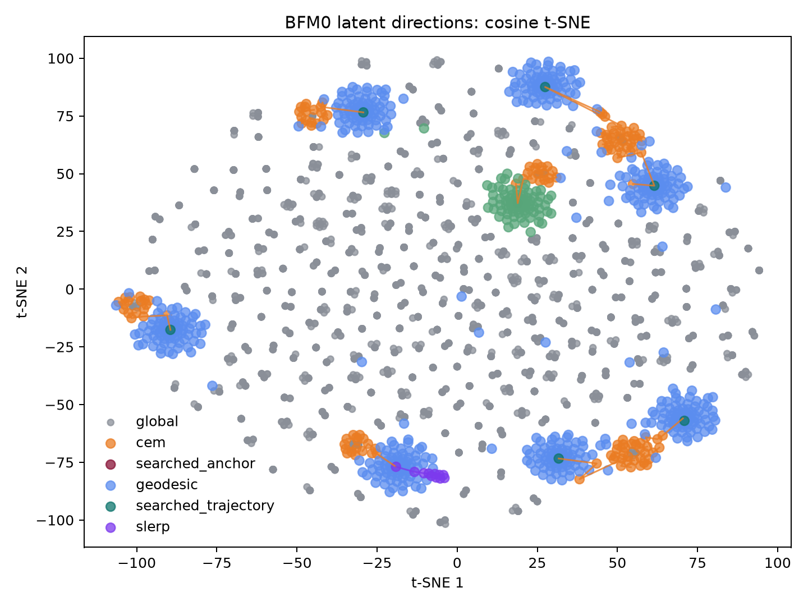
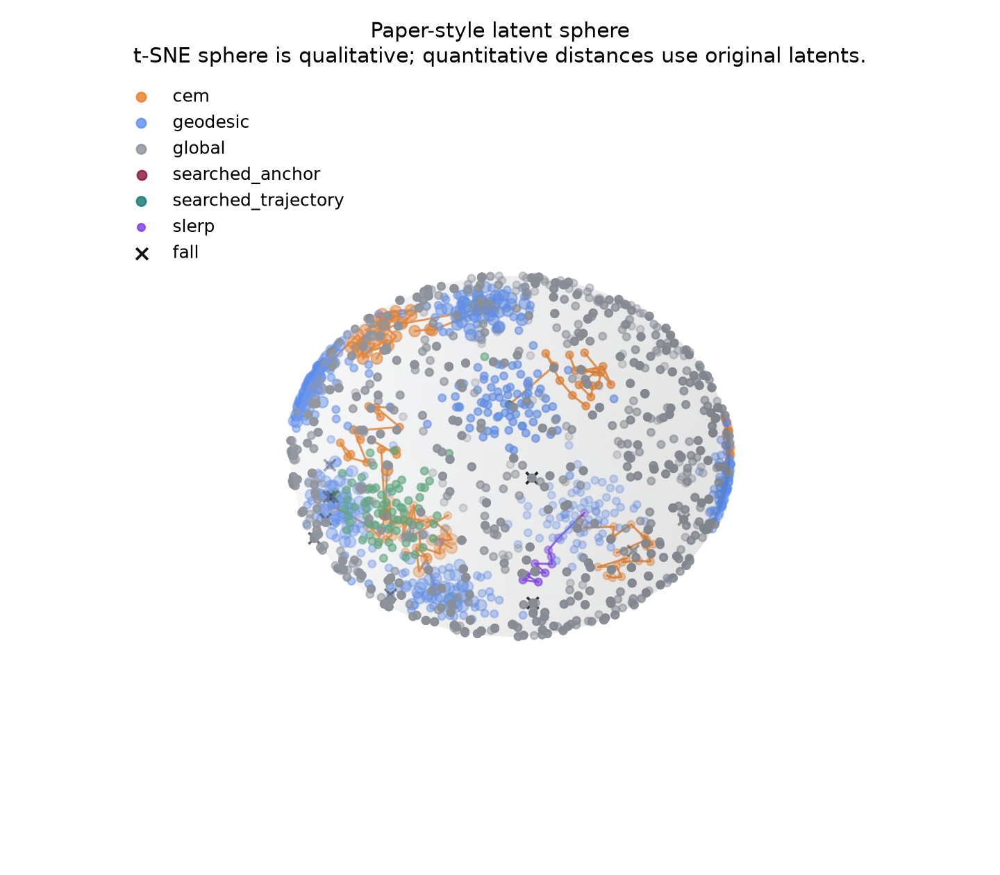
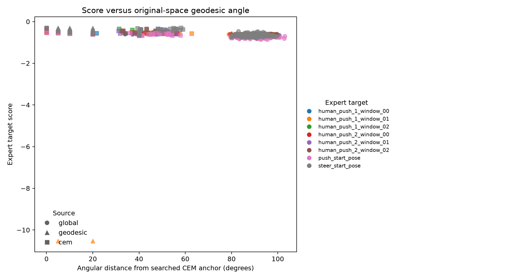
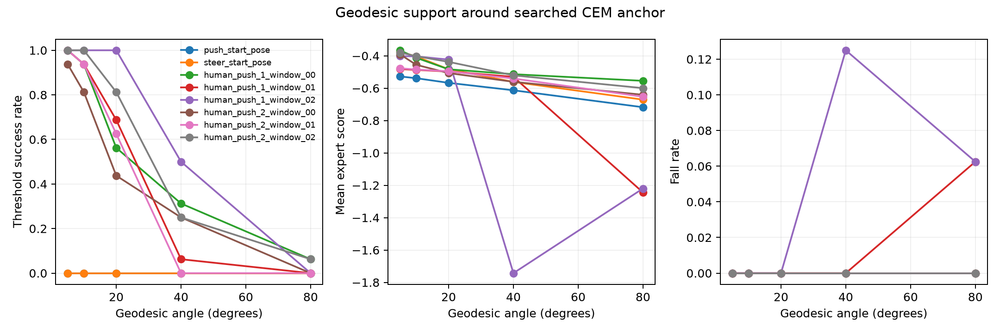
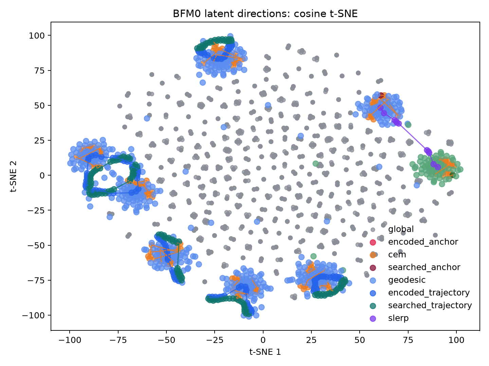
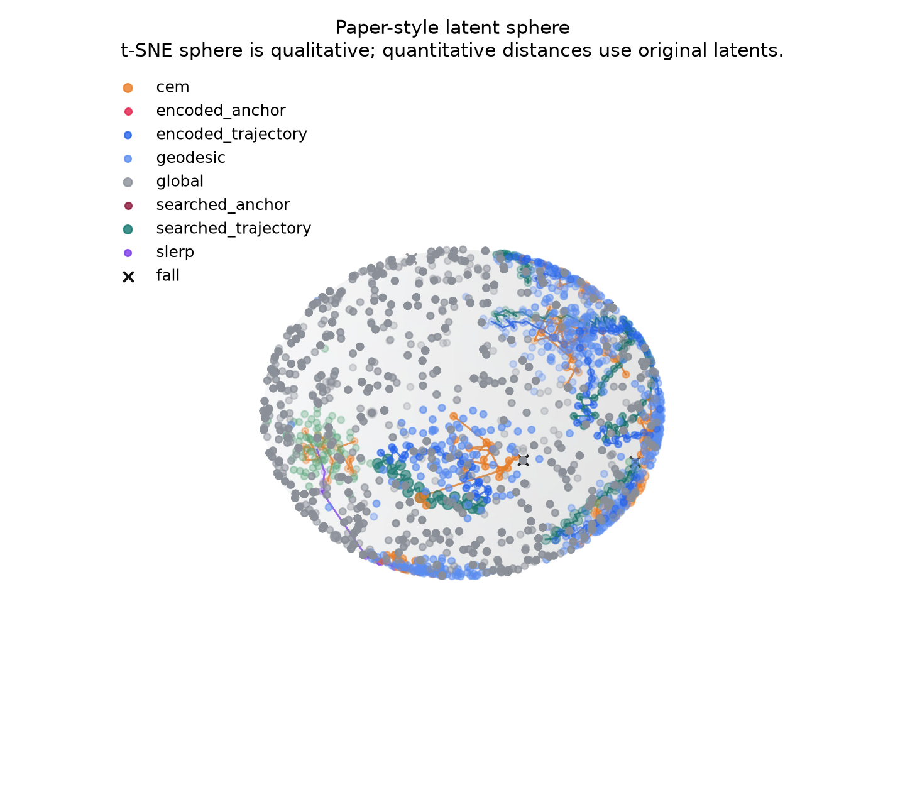
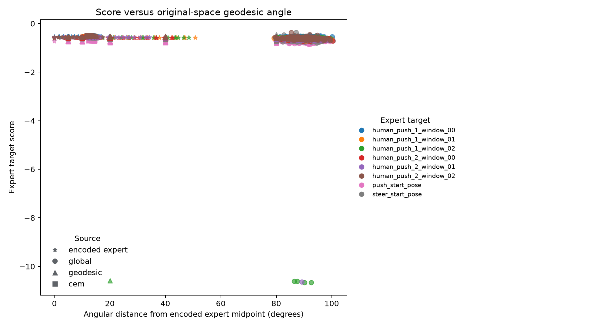
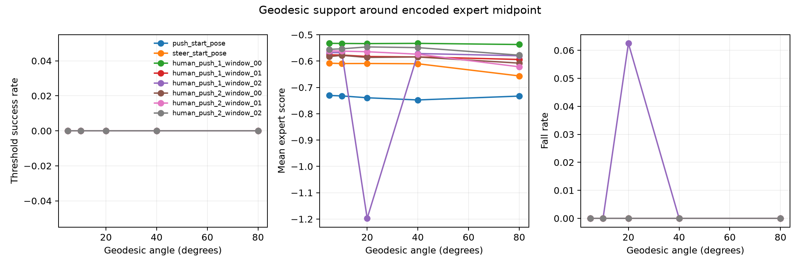

# Experiment Results

## Comparison

| Study date | Experiment | Latent proposal | Stable coverage | Main result |
|---|---|---|---:|---|
| 2026-07-31 | `h1_bfm0_motion_without_prior` | Target-conditioned retrieval: 256 global sphere samples, then broad CEM from each target's global best | 2/8 | Retrieved stable short-horizon meta-actions for two skateboard motion targets without expert latent proposals |
| 2026-08-01 | `h1_bfm0_motion_with_prior` | Time-aligned expert `z_t`, then trajectory-local CEM | 1/8 | Retrieved one stable candidate inside the expert-trajectory neighborhood after state-aligned initialization |

The without-prior run performs goal-directed retrieval over the frozen BFM0
latent space. It does not use expert poses to propose latents: expert data
defines the skateboard motion targets, rollout initial states, and evaluation
scores only. The search found stable local regions for
`human_push_1_window_00` and `human_push_1_window_02`, with robust success
rates of `0.95` and `0.75`.

The state-aligned with-prior rerun found one stable local region for
`human_push_2_window_02`, with robust success rate `0.85`. Every dynamic
target used 24 next-frame latents and its own expert-window qpos/qvel. Adjacent
expert latent angles were `1.26-6.37` degrees and window endpoint angles were
`24.02-71.60` degrees, confirming that the encoded trajectories are
time-varying rather than collapsed. Prior-local CEM stayed within
`12.15-14.74` degrees of the complete expert trajectory.

The without-prior result establishes that the tested frozen BFM0 contains
short-horizon motions satisfying two current skateboard joint-trajectory
targets under the HUSKY adapter. The six failed finite searches do not prove
that matching latents are absent or that BFM0's motion-library limit has been
reached. The candidates also do not yet constitute a complete pushing skill:
dynamic scoring currently uses the common 23 joint positions without root
trajectory, foot contact, or synchronized skateboard state. Diversity
diagnostics are supporting checks on proposal breadth, not the experiment
objective.

# H1 Frozen BFM0 Motion Coverage

## h1_bfm0_motion_without_prior

### Experiment metadata

- Experiment name: h1_bfm0_motion_without_prior
- Experiment type: H1 Frozen BFM0 Motion Coverage
- Study date: 2026-07-31
- Prior mode: `without_prior`
- Start time: 2026-08-02T11:42:25.034965+08:00
- End time: 2026-08-02T11:52:25.311883+08:00
- Duration: 600.246 seconds
- Git commit: `b68643b5c4800f5e34d03db5a9595c3dad123caa`
- Checkpoint: `model/bfm-zero-official`
- Device: `cuda`
- Result directory: `docs/res/h1_bfm0_motion_without_prior`

### Expert dataset status

| Dataset | Format confirmed | Used as BFM input | Used as search target | Limitation |
|---|---:|---:|---:|---|
| push_start_pose | true | False | True | Used only for evaluation; excluded from latent proposal generation |
| steer_start_pose | true | False | True | Used only for evaluation; excluded from latent proposal generation |
| human_push_1 | true | False | True | Used only for evaluation; excluded from latent proposal generation |
| human_push_2 | true | False | True | Used only for evaluation; excluded from latent proposal generation |

### Configuration

- Prior mode: without_prior
- Global sphere samples: 256
- CEM population: 64
- CEM iterations: 6
- Horizon: 0.5
- Seeds: [0, 1, 2]
- Robust trials: 20
- Geodesic angles: [5, 10, 20, 40, 80]
- Samples per angle: 16
- Action gain: 1.0
- CEM maximum angle from search reference: 180.0 degrees
- CEM temporal noise correlation: 0.0
- Static rollouts start from their reconstructed expert pose
- Human-push rollouts start from each window's first expert qpos/qvel; global translation and heading are aligned to the skateboard

### Main results

| Expert target | Latent steps | Encoded score | Encoded robust | Global best | CEM best | CEM max angle | CEM robust | Coverage type |
|---|---:|---:|---:|---:|---:|---:|---:|---|
| push_start_pose | 0 | n/a | n/a | -0.662178 | -0.523622 | 41.24 deg | 0.000 | not_covered |
| steer_start_pose | 0 | n/a | n/a | -0.368672 | -0.287402 | 40.77 deg | 0.000 | fragile |
| human_push_1_window_00 | 0 | n/a | n/a | -0.496919 | -0.251098 | 42.46 deg | 0.950 | locally_covered |
| human_push_1_window_01 | 0 | n/a | n/a | -0.567508 | -0.475055 | 41.20 deg | 0.400 | fragile |
| human_push_1_window_02 | 0 | n/a | n/a | -0.541270 | -0.367334 | 36.78 deg | 0.750 | locally_covered |
| human_push_2_window_00 | 0 | n/a | n/a | -0.568968 | -0.522360 | 40.29 deg | 0.000 | not_covered |
| human_push_2_window_01 | 0 | n/a | n/a | -0.571243 | -0.504313 | 39.05 deg | 0.150 | not_covered |
| human_push_2_window_02 | 0 | n/a | n/a | -0.359733 | -0.292182 | 44.72 deg | 0.550 | fragile |

### Latent-space results

| Metric | Result |
|---|---:|
| Push-steer angular distance (degrees) | 90.02168273925781 |
| Global stable proposal rate | 0.99755859375 |
| Latent-behavior Spearman correlation | 0.038124072015193224 |

### Main findings

No expert backward-map latent is used for proposal generation. Expert poses and motions are used only as common evaluation targets and rollout initial conditions.

Broad CEM improved the global-best score for 8/8 targets. Its distance from the global-best initialization ranged 36.78-44.72 degrees.

The search first evaluates uniformly sampled constant latent directions on the frozen BFM0 sphere, then refines each target from its global best.

2/8 targets met the formal coverage criteria. Coverage failure means the selected frozen-BFM0 behavior was not maintained under the adapted actor, coupled skateboard physics, and current thresholds.

The per-target classifications above require the final static pose or full dynamic window to meet its threshold; a transient intermediate pose is not counted as success.

### Latent-space visualizations

### Videos

- [Push pose: global best](res/h1_bfm0_motion_without_prior/videos/push_pose_global_best.mp4)
- [Steer pose: global best](res/h1_bfm0_motion_without_prior/videos/steer_pose_global_best.mp4)
- [Push pose: CEM best](res/h1_bfm0_motion_without_prior/videos/push_pose_cem_best.mp4)
- [Steer pose: CEM best](res/h1_bfm0_motion_without_prior/videos/steer_pose_cem_best.mp4)
- [Human push 1 window 00: CEM best](res/h1_bfm0_motion_without_prior/videos/human_push_1_window_00_cem_best.mp4)
- [Human push 1 window 02: CEM best](res/h1_bfm0_motion_without_prior/videos/human_push_1_window_02_cem_best.mp4)
- [Push-steer midpoint](res/h1_bfm0_motion_without_prior/videos/push_steer_midpoint_blend.mp4)
- [All generated videos](res/h1_bfm0_motion_without_prior/videos/)

### Limitations

- Static expert velocities are set to zero when constructing backward observations.
- Dynamic expert velocities are reconstructed by finite differences at 50 Hz.
- Static scoring uses all 30 confirmed robot bodies relative to the skateboard.
- Dynamic scoring uses only the confirmed common 23 joint positions at 50 Hz.
- Human-push files do not include synchronized skateboard state; initialization aligns the expert feet to the HUSKY deck while preserving expert pose and velocity.
- The current short-horizon experiment does not validate complete skateboarding.
- Foot contact metrics are not included in H1 coverage.
- t-SNE sphere plots are qualitative; quantitative distances use original latents.
- Without-prior score-angle plots use the searched constant-latent CEM anchor as their reference.

# H1 Frozen BFM0 Motion Coverage

## h1_bfm0_motion_with_prior

### Experiment metadata

- Experiment name: h1_bfm0_motion_with_prior
- Experiment type: H1 Frozen BFM0 Motion Coverage
- Study date: 2026-08-01
- Prior mode: `with_prior`
- Start time: 2026-08-02T12:01:58.609537+08:00
- End time: 2026-08-02T12:12:06.311775+08:00
- Duration: 607.684 seconds
- Git commit: `7ba5810143986eb378b1a3d6a3d15ceb89aab653`
- Checkpoint: `model/bfm-zero-official`
- Device: `cuda`
- Result directory: `docs/res/h1_bfm0_motion_with_prior`

### Expert dataset status

| Dataset | Format confirmed | Used as BFM input | Used as search target | Limitation |
|---|---:|---:|---:|---|
| push_start_pose | true | True | True | Official backward observation reconstructed from confirmed fields |
| steer_start_pose | true | True | True | Official backward observation reconstructed from confirmed fields |
| human_push_1 | true | True | True | Official backward observation reconstructed from confirmed fields |
| human_push_2 | true | True | True | Official backward observation reconstructed from confirmed fields |

### Configuration

- Prior mode: with_prior
- Global sphere samples: 256
- CEM population: 64
- CEM iterations: 6
- Horizon: 0.5
- Seeds: [0, 1, 2]
- Robust trials: 20
- Geodesic angles: [5, 10, 20, 40, 80]
- Samples per angle: 16
- Action gain: 1.0
- CEM maximum angle from search reference: 40.0 degrees
- CEM temporal noise correlation: 0.9
- Static rollouts start from their reconstructed expert pose
- Human-push rollouts start from each window's first expert qpos/qvel; global translation and heading are aligned to the skateboard

### Main results

| Expert target | Latent steps | Encoded score | Encoded robust | Global best | CEM best | CEM max angle | CEM robust | Coverage type |
|---|---:|---:|---:|---:|---:|---:|---:|---|
| push_start_pose | 1 | -0.727388 | 0.000 | -0.662178 | -0.687604 | 13.85 deg | 0.000 | not_covered |
| steer_start_pose | 1 | -0.608622 | 0.000 | -0.368672 | -0.499037 | 14.15 deg | 0.000 | not_covered |
| human_push_1_window_00 | 24 | -0.532793 | 0.000 | -0.496919 | -0.497779 | 13.80 deg | 0.250 | fragile |
| human_push_1_window_01 | 24 | -0.576890 | 0.000 | -0.567508 | -0.518339 | 13.09 deg | 0.000 | not_covered |
| human_push_1_window_02 | 24 | -0.579753 | 0.000 | -0.541270 | -0.527105 | 14.00 deg | 0.000 | not_covered |
| human_push_2_window_00 | 24 | -0.583071 | 0.000 | -0.568968 | -0.547325 | 12.15 deg | 0.000 | not_covered |
| human_push_2_window_01 | 24 | -0.561036 | 0.000 | -0.571243 | -0.524113 | 13.42 deg | 0.000 | not_covered |
| human_push_2_window_02 | 24 | -0.557242 | 0.000 | -0.359733 | -0.479503 | 14.74 deg | 0.850 | locally_covered |

### Latent-space results

| Metric | Result |
|---|---:|
| Push-steer angular distance (degrees) | 79.63737487792969 |
| Global stable proposal rate | 0.99755859375 |
| Latent-behavior Spearman correlation | 0.038124072015193224 |

### Main findings

Static goal latents and time-aligned dynamic latent trajectories are produced by the frozen official backward map from reconstructed expert observations. Dynamic execution follows the official next-frame pattern `z_t = project_z(backward_map(obs[t + 1]))`.

Trajectory-local CEM improved the encoded score for 8/8 targets. The per-target maximum trajectory angle ranged 12.15-14.74 degrees.

Random constant-latent sampling is reported only as a baseline. Dynamic CEM starts from the complete encoded expert trajectory and uses time-correlated perturbations under a per-step angular cap.

1/8 targets met the formal coverage criteria. Coverage failure means the selected frozen-BFM0 behavior was not maintained under the adapted actor, coupled skateboard physics, and current thresholds.

The per-target classifications above require the final static pose or full dynamic window to meet its threshold; a transient intermediate pose is not counted as success.

### Latent-space visualizations

### Videos

- [Push pose: encoded expert goal](res/h1_bfm0_motion_with_prior/videos/push_pose_encoded_anchor.mp4)
- [Steer pose: encoded expert goal](res/h1_bfm0_motion_with_prior/videos/steer_pose_encoded_anchor.mp4)
- [Human push 1 window 00: encoded trajectory](res/h1_bfm0_motion_with_prior/videos/human_push_1_window_00_encoded_trajectory.mp4)
- [Human push 2 window 02: encoded trajectory](res/h1_bfm0_motion_with_prior/videos/human_push_2_window_02_encoded_trajectory.mp4)
- [Push pose: CEM best](res/h1_bfm0_motion_with_prior/videos/push_pose_cem_best.mp4)
- [Steer pose: CEM best](res/h1_bfm0_motion_with_prior/videos/steer_pose_cem_best.mp4)
- [Human push 1 window 00: CEM best](res/h1_bfm0_motion_with_prior/videos/human_push_1_window_00_cem_best.mp4)
- [Human push 2 window 02: CEM best](res/h1_bfm0_motion_with_prior/videos/human_push_2_window_02_cem_best.mp4)
- [Push-steer midpoint](res/h1_bfm0_motion_with_prior/videos/push_steer_midpoint_blend.mp4)
- [All generated videos](res/h1_bfm0_motion_with_prior/videos/)

### Limitations

- Static expert velocities are set to zero when constructing backward observations.
- Dynamic expert velocities are reconstructed by finite differences at 50 Hz.
- Static scoring uses all 30 confirmed robot bodies relative to the skateboard.
- Dynamic scoring uses only the confirmed common 23 joint positions at 50 Hz.
- Human-push files do not include synchronized skateboard state; initialization aligns the expert feet to the HUSKY deck while preserving expert pose and velocity.
- The current short-horizon experiment does not validate complete skateboarding.
- Foot contact metrics are not included in H1 coverage.
- t-SNE sphere plots are qualitative; quantitative distances use original latents.
- Dynamic score-angle plots use trajectory midpoints for display; CEM constraints and reported maximum angles use every original latent step.
