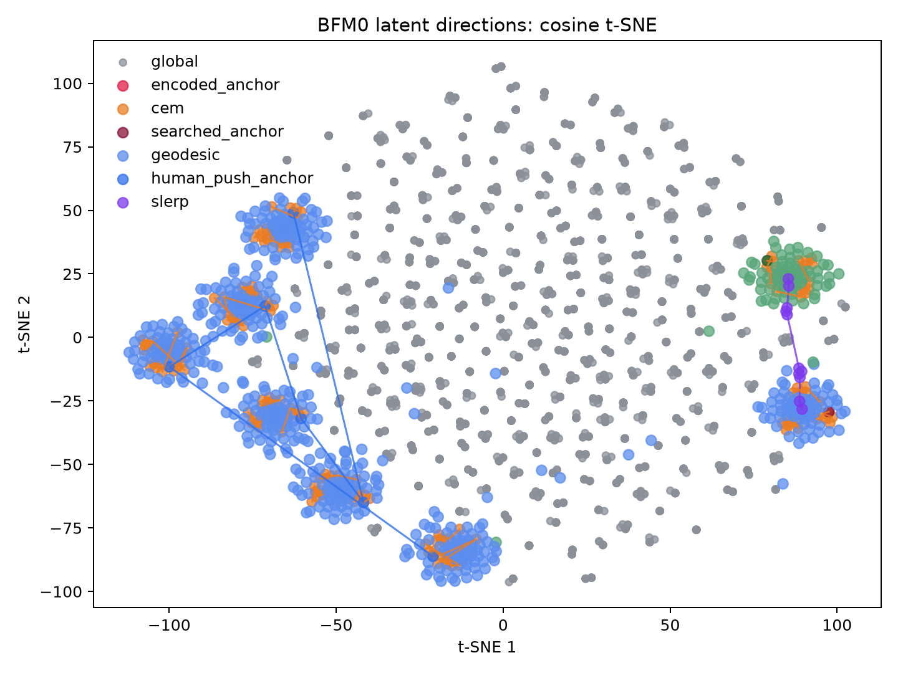
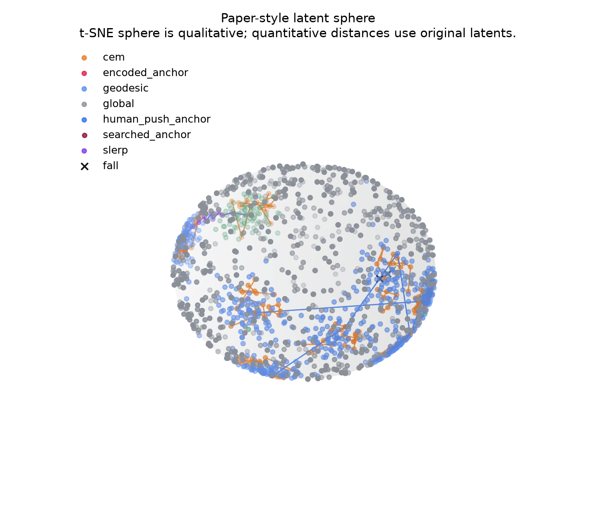
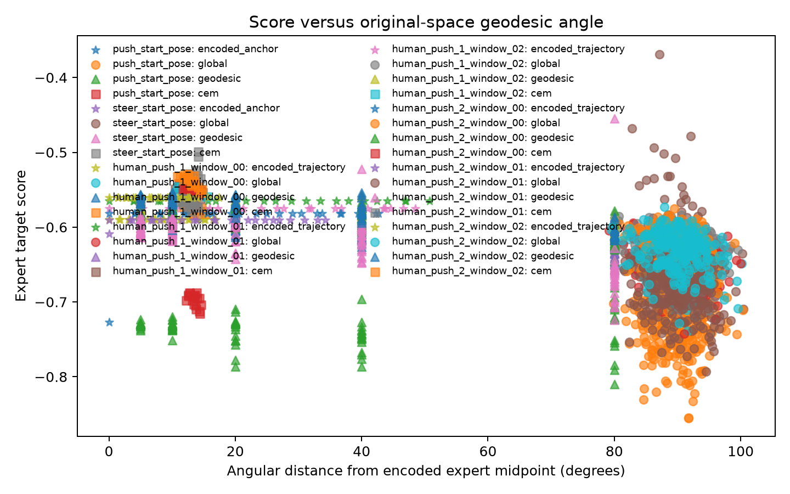
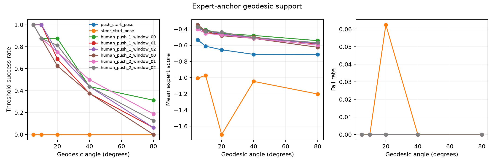

# Experiment Results

# H1 Expert-Guided BFM0 Behavior Coverage

## h1_bfm_coverage_bfmzero_official

### Experiment metadata

- Experiment name: h1_bfm_coverage_bfmzero_official
- Experiment type: H1 Expert-Guided BFM0 Behavior Coverage
- Start time: 2026-08-01T21:02:59.597005+08:00
- End time: 2026-08-01T21:11:37.175196+08:00
- Duration: 517.552 seconds
- Git commit: `6623a48d94b889b589f1407aa3e82a3e1da37246`
- Checkpoint: `model/bfm-zero-official`
- Device: `cuda`
- Result directory: `docs/res/h1_bfm_coverage_bfmzero_official`

### Expert dataset status

| Dataset | Format confirmed | Used as BFM input | Used as search target | Limitation |
|---|---:|---:|---:|---|
| push_start_pose | true | True | True | Official backward observation reconstructed from confirmed fields |
| steer_start_pose | true | True | True | Official backward observation reconstructed from confirmed fields |
| human_push_1 | true | True | True | Official backward observation reconstructed from confirmed fields |
| human_push_2 | true | True | True | Official backward observation reconstructed from confirmed fields |

### Configuration

- Global sphere samples: 256
- CEM population: 64
- CEM iterations: 6
- Horizon: 0.5
- Seeds: [0, 1, 2]
- Robust trials: 20
- Geodesic angles: [5, 10, 20, 40, 80]
- Samples per angle: 16
- Action gain: 1.0
- CEM maximum angle from encoded anchor: 40.0 degrees
- Static rollouts start from their reconstructed expert pose
- Human-push rollouts start from the push expert pose because the motion files do not include skateboard state

### Main results

| Expert target | Encoded score | Encoded robust | Global best | CEM best | CEM angle | CEM robust | Coverage type |
|---|---:|---:|---:|---:|---:|---:|---|
| push_start_pose | -1.138241 | 0.000 | -1.030625 | -1.045835 | 12.37 deg | 0.000 | not_covered |
| steer_start_pose | -1.098281 | 0.000 | -0.847677 | -0.998107 | 12.83 deg | 0.000 | not_covered |
| human_push_1_window_00 | -0.601383 | 0.000 | -0.604842 | -0.553971 | 12.37 deg | 0.000 | not_covered |
| human_push_1_window_01 | -0.592272 | 0.000 | -0.592723 | -0.552415 | 12.50 deg | 0.000 | not_covered |
| human_push_1_window_02 | -0.565941 | 0.000 | -0.584074 | -0.531432 | 11.78 deg | 0.000 | not_covered |
| human_push_2_window_00 | -0.574201 | 0.000 | -0.575069 | -0.549567 | 11.48 deg | 0.000 | not_covered |
| human_push_2_window_01 | -0.584426 | 0.000 | -0.615353 | -0.557333 | 11.39 deg | 0.000 | not_covered |
| human_push_2_window_02 | -0.566790 | 0.000 | -0.572806 | -0.533452 | 12.36 deg | 0.000 | not_covered |

### Latent-space results

| Metric | Result |
|---|---:|
| Push-steer angular distance (degrees) | 79.63737487792969 |
| Global stable proposal rate | 1.0 |
| Latent-behavior Spearman correlation | 0.038124072015193224 |

### Main findings

Encoded anchors are produced by the frozen official backward map from reconstructed expert observations. No unknown observation field is zero-filled.

Local CEM improved the encoded-anchor score for 8/8 targets. Selected CEM latents remained 11.39-12.83 degrees from their encoded expert anchors.

0/8 targets met the formal coverage criteria. A failed rollout does not imply failed expert encoding; it means the encoded behavior was not maintained under the adapted actor, coupled skateboard physics, and current thresholds.

The per-target classifications above require the final static pose or full dynamic window to meet its threshold; a transient intermediate pose is not counted as success.

Random global sampling is reported only as a baseline. CEM starts at the encoded expert anchor and is constrained by the configured angular cap.

### Latent-space visualizations

### Videos

- [Push pose: encoded expert anchor](res/h1_bfm_coverage_bfmzero_official/videos/push_pose_encoded_anchor.mp4)
- [Push pose: CEM best](res/h1_bfm_coverage_bfmzero_official/videos/push_pose_cem_best.mp4)
- [Steer pose: encoded expert anchor](res/h1_bfm_coverage_bfmzero_official/videos/steer_pose_encoded_anchor.mp4)
- [Steer pose: CEM best](res/h1_bfm_coverage_bfmzero_official/videos/steer_pose_cem_best.mp4)
- [Push-steer midpoint](res/h1_bfm_coverage_bfmzero_official/videos/push_steer_midpoint_blend.mp4)
- [All generated videos](res/h1_bfm_coverage_bfmzero_official/videos/)

### Limitations

- Static expert velocities are set to zero when constructing backward observations.
- Dynamic expert velocities are reconstructed by finite differences at 50 Hz.
- Static scoring uses all 30 confirmed robot bodies relative to the skateboard.
- Dynamic scoring uses only the confirmed common 23 joint positions at 50 Hz.
- The current short-horizon experiment does not validate complete skateboarding.
- Foot contact metrics are not included in H1 coverage.
- t-SNE sphere plots are qualitative; quantitative distances use original latents.
