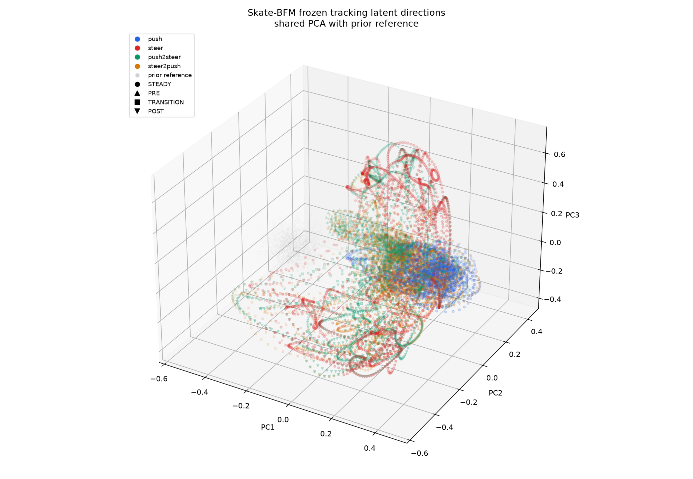

# Latent Space Analysis

- Checkpoint: `/home/hm/workspace/skate-bfm/model/motion_library/m2.6-p2-phase-200k-seed4728/checkpoint_200000`
- Split: `val`
- Cases: `80` (push=20, steer=20, push2steer=20, steer2push=20)
- Latent source: the exact tracking `z_t` returned by `AlignedSkateTrackingContext.encode` and consumed by the frozen actor.
- Prior reference: 4096 deterministic samples from the checkpoint model's `sample_z`, seed `4728`.
- Projection: PCA is fitted jointly on normalized directions `u=z/||z||` from prior and evaluated latents.
- Limitation: the 3D plot shows a direction projection, not lossless 256D geometry and not task success.

## Behavior Statistics

| Behavior | Count | Norm mean | Norm std | PCA centroid (x, y, z) |
|---|---:|---:|---:|---|
| push | 1681 | 16 | 4.1569e-07 | (0.17197, 0.18375, -0.13095) |
| steer | 2000 | 16 | 3.9726e-07 | (0.14695, -0.14881, 0.18837) |
| push2steer | 3843 | 16 | 4.1553e-07 | (0.098169, -0.0016576, 0.011618) |
| steer2push | 3814 | 16 | 4.0981e-07 | (0.11477, 0.039484, -0.058535) |

The norm columns describe the magnitude of the actual 256D latent. The centroid is in the shared PCA coordinate system.

## Structure

- Nearest-centroid accuracy: `0.5062`.
- Silhouette score (cosine, deterministic subsample): `0.0155`.
- Pairwise cosine distances are computed on normalized latent directions; PCA distances are only distances in the displayed 3D projection.

## Transition Continuity

| Behavior | PRE count | TRANSITION count | POST count | PRE -> TRANSITION cosine | TRANSITION -> POST cosine | Adjacent cosine mean | Adjacent cosine p95 |
|---|---:|---:|---:|---:|---:|---:|---:|
| push2steer | 980 | 600 | 1881 | 0.42057 | 0.51271 | 0.0082999 | 0.019899 |
| steer2push | 980 | 300 | 1919 | 0.41051 | 0.44328 | 0.0096906 | 0.020286 |

PRE, TRANSITION, and POST are assigned from each case's formal `frame_phase` mapping. Adjacent distances use consecutive latent values within each executed case, including across phase boundaries.

## Interpretation

This analysis describes which latent directions the frozen policy actually visited under the fixed benchmark. Separation or continuity is not evidence of task success; task metrics and completion remain the authoritative performance measures.
