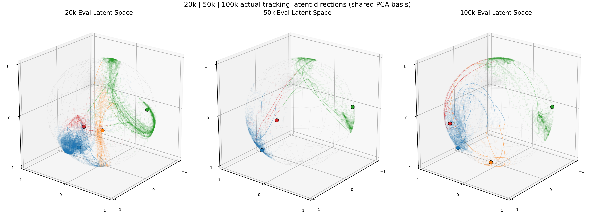

# Skate-BFM Training Results

Results use the same three experiment names as [`train.md`](train.md).
`[x]` marks completed verification; `[ ]` marks an unverified conclusion.

## Experiment 1: Training Workspace and BFM-HUSKY Integration

### Stage Results

| Check | Result |
|---|---|
| Independent `train` branch | PASS |
| Vendored BFM runtime construction | PASS |
| Official checkpoint strict load | 537 tensors, PASS |
| HUSKY headless step | PASS |
| Interactive MuJoCo viewer | PASS |
| BFM action to HUSKY action | `[29] -> [23]`, PASS |
| State / privileged / last action / history | `[64] / [463] / [29] / [372]`, PASS |
| Latent | `[256]`, finite, norm 16 |

**Caption.** Bracketed values are tensor widths, not physical magnitudes:
state/privileged state/last action/history contain 64/463/29/372 values, and
the latent has 256 values. `DoF` means degree of freedom; the norm-16 latent
uses the BFM convention for a 256-dimensional vector. `Strict load` means all
537 checkpoint tensors matched by name and shape; `PASS` records a completed
interface check, not policy quality.

One initial 50-frame HUSKY sample loaded beside the original 862-motion LAFAN
library. The official expert loader produced finite Base and Skate batches
with `state [16,64]`, `last_action [16,29]`, and
`privileged_state [16,463]`.

### Verified and Unverified Conclusions

- [x] BFM0 and HUSKY communicate through one reproducible tensor and joint-name
  contract.
- [x] The training workspace no longer needs the original BFM source directory
  at runtime.
- [ ] Stable Skate behavior follows from interface compatibility alone.

**Caption.** These are software/interface results, not model-performance
results.

## Experiment 2: HUSKY Expert Dataset Collection and Construction

### Stage Results

**Raw collection**

| Quantity | Result |
|---|---:|
| Command cells | 75 |
| Baseline episodes | 150 |
| Replacement episodes | 8 |
| Worker failures | 0 |
| Full 60 s episodes | 125 |
| Fall-terminated episodes | 33 |
| Frames | 452,885 |
| Duration | 150.962 min |
| Duration target | PASS |

**Caption.** `Command cells` are distinct `(velocity, heading)` settings;
`baseline episodes` are the planned two samples per cell and `replacement
episodes` extend collection after short fall-terminated rollouts. `Full` and
`fall-terminated` partition the 158 completed episodes; `worker failures` are
process-level collection errors. A frame is one 50 Hz sample, and duration is
accumulated simulation minutes. A confirmed fall is a valid episode boundary,
not a failed worker.

**Phase dataset**

| Phase | Motions | Frames | Duration |
|---|---:|---:|---:|
| push | 1,522 | 182,296 | 60.258 min |
| push2steer | 1,516 | 45,471 | 14.652 min |
| steer_left | 685 | 91,205 | 30.173 min |
| steer_forward | 109 | 14,670 | 4.854 min |
| steer_right | 717 | 96,314 | 31.866 min |
| steer2push | 1,489 | 22,335 | 6.949 min |
| **Total** | **6,038** | **452,291** | **148.751 min** |

**Caption.** `Motions` counts contiguous MotionLib records, `frames` counts
their source time samples, and duration is `(frames-1)/50` seconds per motion
summed over records. The phase labels are command-clock categories; counts
are descriptive, not target proportions.

Discarded data:

| Reason | Frames / segments |
|---|---:|
| Confirmed fall | 330 frames |
| Pre-fall margin | 240 frames |
| Too short for Seq8 | 6 segments |
| Complete rollout rejection | 0 |

**Caption.** A confirmed fall and its pre-fall margin are removed from training
segments. `Seq8` needs eight transitions plus one next-state frame; fewer
frames cannot produce a complete sample. Fewer discarded frames/segments is
preferable, provided unsafe fall tails are excluded.

**Continuous dataset**

| Quantity | Result |
|---|---:|
| Clips | 890 |
| Clip size | 500 frames / 10.0 s |
| Stride / overlap | 500 / 0 |
| Frames | 445,000 |
| Duration | 148.333 min |
| Tail discarded | 7,310 frames |
| Clips crossing normal phase transitions | 890/890 |
| Clips crossing fall/reset | 0 |

**Caption.** `Clips` are continuous records, each `500 frames = 10.0 s` at
50 Hz. `Stride` is the frame offset between clip starts and `overlap` is the
number of shared frames. A tail is the valid remainder shorter than one clip;
normal phase transitions are allowed, but fall/reset boundaries are not.

### Verified and Unverified Conclusions

- [x] Official MotionLib loading and Seq8 expert sampling pass for Phase and
  Continuous.
- [x] Every processed record retains raw frame provenance.
- [x] Phase QC contains 60 samples; Continuous QC contains 10 samples.
- [x] [Raw collection](https://huggingface.co/datasets/Yak9Ce3teeh/skate-sim-dataset/tree/main/raw)
- [x] [Phase MotionLib and QC](https://huggingface.co/datasets/Yak9Ce3teeh/skate-sim-dataset/tree/main/phase)
- [x] [Continuous MotionLib and QC](https://huggingface.co/datasets/Yak9Ce3teeh/skate-sim-dataset/tree/main/continuous)
- [ ] Held-out validation/test source collection.
- [ ] Equal expert quality across every phase and command cell.

**Caption.** MotionLib and provenance validation establish data correctness,
not learned motion quality.

The linked Phase QC videos visualize robot-plus-skateboard replays for 10
samples per phase; Continuous QC visualizes 10 fixed 500-frame clips. These
are dataset-quality checks, not trained-policy performance videos.

## Experiment 3: BFM + Skate Expert Training and Semantics Alignment

### Training Process Results

Fixed 1,024-transition replay:

| Check | Result |
|---|---:|
| Normal / terminal / truncated transitions | 1,009 / 14 / 1 |
| Auxiliary reward keys | 8/8 finite |
| Base/Skate expert sequences | 64 / 64, length 8 |
| Native update tests | 1, 10, 100 |
| Six optimizer steps after final test | 100 each |
| z-buffer | 8,192 / 8,192 |
| Model and normalizers finite | PASS |

**Caption.** A transition is one `(state, action, next state)` record.
`Normal`, `terminal`, and `truncated` counts distinguish continuing samples,
failure-ended episodes, and time-limit-ended episodes. `Seq8` is eight
consecutive transitions. `Auxiliary reward keys` counts the eight configured
penalty terms; `native update tests` are cumulative update depths; `six
optimizer steps` checks each network optimizer reached step 100. The z-buffer
stores 8,192 latent vectors; `finite` means no NaN or Inf was found.

Representative fixed-replay optimization:

| Metric | Update 1 | Update 10 | Update 100 |
|---|---:|---:|---:|
| FB loss | 1,283,845 | 1,053,397 | 286,643 |
| Discriminator loss | 0.4494 | 0.0580 | 0.0125 |
| Main critic loss | 1,796.0 | 1,977.3 | 39.6 |
| Auxiliary critic loss | 248.9 | 171.0 | 53.5 |
| Actor loss | 50,068 | 34,344 | 22,388 |

**Caption.** `FB` is the forward-backward representation objective;
discriminator loss separates expert from online transitions, critic losses fit
value estimates, and Actor loss updates the policy. These are scalar
optimization objectives with implementation-specific scales; finite values
and downward trends are diagnostics, not proof of policy improvement.

**20k closed-loop bring-up**

| Quantity | Result |
|---|---:|
| Online transitions | 20,000 |
| Update blocks / native updates | 38 / 1,900 |
| Normal / terminal / truncated | 19,592 / 389 / 19 |
| Checkpoints | 10k, 20k |
| Checkpoint reload | PASS |
| Fixed-evaluation falls | 60/60 |

**Caption.** `Online transitions` are environment steps, `update blocks` are
scheduled groups of updates, and `native updates` are optimizer update calls.
`Normal/terminal/truncated` respectively count continuing, fall-ended, and
time-limit-ended transitions. `10k/20k checkpoints` are snapshots saved at
those transition counts. Reload verifies serialized state; fixed-evaluation
falls are terminated test episodes, where fewer is better.

| Metric | Start | 10k | 20k |
|---|---:|---:|---:|
| FB loss | 986,467 | 23,839 | 11,141 |
| Discriminator loss | 0.4382 | 0.3296 | 0.2129 |
| Main critic loss | 1,129.67 | 37.51 | 45.73 |
| Auxiliary critic loss | 166.75 | 8.68 | 36.62 |
| Actor loss | 48,756.79 | 21,856.67 | 6,030.91 |

**Caption.** `10k` and `20k` denote online transition counts. Loss values are
training diagnostics rather than rewards; lower is often desirable for the
same objective, but matched frozen behavior is the deciding criterion.

**Conclusion.** Optimization and checkpointing worked, but every fixed
evaluation episode fell; physical performance was inconclusive.

**Formal Phase 100k run**

| Quantity | Result |
|---|---:|
| Online transitions | 100,000 |
| Update blocks / native updates | 198 / 9,900 |
| Normal transitions | 98,083 |
| Fall terminations | 1,893 |
| Horizon completions | 24 |
| Expert tracking resets | 769 |
| Model/optimizer/normalizer finite | PASS |

**Caption.** `Normal transitions` neither terminate nor truncate; `fall
terminations` end an episode by the persistent fall detector; `horizon
completions` are time-limit truncations; `expert tracking resets` are resets
that received the aligned future-expert latent. For stability, fewer falls and
more horizon completions are preferable.

Checkpoint integrity:

| Checkpoint | Model SHA256 prefix | Optimizer step | Reload |
|---|---|---:|---|
| 20k | `b758f01fd960` | 1,900 | PASS |
| 50k | `b1f16d00ae80` | 4,900 | PASS |
| 100k | `ab8ef719d613` | 9,900 | PASS |

**Caption.** `SHA256 prefix` is a shortened checkpoint content hash,
`optimizer step` is the number of saved update calls, and `reload` verifies
that the checkpoint can reconstruct the model state. These establish artifact
integrity, not behavior.

The complete 100k artifact, frozen evaluations, and training summary are
published as
[`m2.6-phase-100k-seed4728`](https://huggingface.co/Yak9Ce3teeh/skate-bfm/tree/main/motion_library/m2.6-phase-100k-seed4728).

Optimization endpoints:

| Step | FB loss | Disc. loss | Critic loss | Aux critic loss | Actor loss |
|---:|---:|---:|---:|---:|---:|
| 1,500 | 325,215.56 | 0.02593 | 856.73 | 80.34 | 18,889.73 |
| 20,000 | 6,070.78 | 0.20310 | 52.17 | 45.79 | 8,131.50 |
| 50,000 | -3,871.08 | 0.15599 | 12.75 | 3.10 | 954.92 |
| 100,000 | -10,048.30 | 0.08824 | 5.08 | 2.30 | 1,116.23 |

**Caption.** `FB loss` may be negative because its objective contains a
negative diagonal term. `Disc.` is discriminator loss; `Critic` and `Aux
critic` are main and auxiliary value losses; `Actor` is policy loss. Lower is
not by itself evidence of better control.

Matched frozen evaluation:

| Checkpoint | Mean survival | Min / max | Falls |
|---|---:|---:|---:|
| Official BFM0 | 1.264 s | 0.84 / 2.48 s | 32/32 |
| Phase 20k | 0.604 s | 0.42 / 0.84 s | 32/32 |
| Phase 50k | 0.519 s | 0.36 / 0.66 s | 32/32 |
| Phase 100k | 0.643 s | 0.38 / 1.16 s | 32/32 |

**Caption.** Survival is elapsed simulation time before termination; higher
mean and minimum are better. `Min / max` are the observed episode range, and
`Falls` is terminated episodes over the fixed 32-episode evaluation set;
lower is better.

**Historical conclusion.** This earlier 32-case matched evaluation established
that finite numerical execution did not establish behavioral success. The
current R5 held-out comparison below is the authoritative per-checkpoint
comparison for this formal P1 run.

**Formal R5 held-out checkpoint comparison**

All checkpoints replayed the exact same 80 Test cases: 20 rollout-balanced
cases each for `push`, `steer`, `push2steer`, and `steer2push`, selected
without replacement with seed 4728. The complete fixed-case identity hash is
`ff7a290d384d00ae34ff2ccd8c5765227df711bca0fab5e668532234aa12e3ad`;
tracking parity, frozen mutation checks, and representative video replay
passed for all three checkpoints.

| Checkpoint | Push completion | Steer completion | Push2steer completion | Steer2push completion |
|---|---:|---:|---:|---:|
| 20k | 0.986 | 0.965 | 0.893 | 1.000 |
| 50k | 0.580 | 0.730 | 0.121 | 0.222 |
| 100k | 0.760 | 0.894 | 0.301 | 0.434 |

**Caption.** Completion is executed control steps divided by the planned
horizon, averaged over 20 cases per behavior; it ranges from 0 to 1 and
higher is better. Steady skills use 2.0 s / 100 steps and transitions 5.0 s /
250 steps. The shared cases make columns comparable by checkpoint, but this
is a limited held-out Test subset rather than the full Test set.

The 20k checkpoint survived most selected horizons but had poor board
retention/tracking in several behaviors; 50k terminated before every
`push2steer` transition; 100k recovered some completion and retention but
still terminated in 75%, 25%, 95%, and 100% of push, steer, push2steer, and
steer2push cases respectively. Lower board/coupling error for an early-falling
checkpoint is not evidence of better behavior because it is measured only
over its shorter executed prefix.



**Caption.** Each panel shows actual frozen-evaluation tracking `z_t` values:
blue push, green steer, orange push2steer, red steer2push, and faint gray
official-prior reference samples. `z_t` is 256D with norm 16; points use
`u=z/||z||`, one shared PCA-to-3D basis, then normalized 3D directions.
Lines are the first three lexical case trajectories per shown phase and large
markers are high-dimensional direction centroids. The 50k orange category has
zero executed points because all its push2steer cases terminated before the
transition. This figure shows accessed latent directions only; it does not
prove latent coverage, separation, or behavioral causality.

Detailed fixed-case metrics, transition PRE/TRANSITION/POST means, paired
case improve/worsen/tie counts, latent norms, and projection metadata are in
[the comparison report](eval_res/2026-08-20/20k-50k-100k-s20b/comparison.md)
and [machine-readable comparison](eval_res/2026-08-20/20k-50k-100k-s20b/comparison.json).
The three per-checkpoint latent views are
[20k](eval_res/2026-08-20/20k-s20b_test_phase_eval/latent_space.png),
[50k](eval_res/2026-08-20/50k-s20b_test_phase_eval/latent_space.png), and
[100k](eval_res/2026-08-20/100k-s20b_test_phase_eval/latent_space.png).

### Failure Diagnosis and Semantics Correction Results

These rows are diagnostic steps within Experiment 3:

| Process step | Measured result | Current conclusion |
|---|---|---|
| Source physics + exact reset | max qpos/qvel error `0`; physics mismatch `0` | reset contract corrected |
| Active action subspace | shared-action error `0`; six wrists `0` | 23DoF projection correct |
| Observation distribution | waist reaches about 20-27 sigma; expert/online angular velocity 1.0/0.25 | observation asymmetry unresolved |
| First source-to-BFM bridge | used ordinary-G1 target gains | superseded after hard-waist provenance audit |
| Authoritative action bridge | 95.758968% exact components; 37.012707% exact frames | waist targets dominate the projected set |
| Hard-waist controller restoration | B improves `dq/dqdot/torque` RMSE by 20.65% / 18.80% / 48.85% over A | controller restoration passes; timing remains unchanged |
| Same-reset tracking z on old 100k | step-20 root tilt 47.8 -> 25.2 deg; saturation 17.1% -> 0.29% | short old-checkpoint improvement only |

**Caption.** `qpos/qvel` are MuJoCo generalized position/velocity; their reset
errors are expected to be zero. `sigma` is standard deviation from the
reference observation distribution, so 20-27 sigma indicates severe drift.
`RMSE` is root-mean-square error, where lower is better. Root tilt is torso
inclination in degrees; action saturation is the fraction at the normalized
action limit, where lower usually leaves more control margin. `Strict-5
coverage` requires the current source action and four prior history actions to
be representable by the BFM action range.

**Skate expert action matching process**

The source policy and BFM Actor do not share the same normalized action
coordinates. The tested physical-target equations were:

```text
q_target_src[j] = q0_src[j] + s_src[j] * a_src[j]
a_env[j] = clip(5 * a_bfm[j], -5, 5)
G_bfm[j] = 5 * 0.25 * effort_hard-waist[j] / Kp_hard-waist[j]
q_target_bfm[j] = q0_hard-waist[j] + G_bfm[j] * a_bfm[j]

a_bfm_eq[j] =
    (q0_src[j] + s_src[j] * a_src[j] - q0_hard-waist[j])
    / G_bfm[j]
```

The prior bridge used ordinary-G1 scales and is superseded. The formal BFM0
entrypoint resolves `g1_29dof_hard_waist` with `normalize_from=1`,
`normalize_to=5`, action clip `5`, action scale `0.25`, and position control.
The production HUSKY runtime now applies the matching `q0`, `Kp`, `Kd`, effort
limit, and normalized target gain to its 23 robot actuators.

Authoritative representability:

| Quantity | Result |
|---|---:|
| Raw rollout count / frames | 158 / 452,885 |
| BFM-equivalent action range | `[-9.588672, 9.545807]` |
| Exact component coverage | 95.758968% |
| Exact full-frame coverage | 37.012707% |
| Projected frames | 285,260 |
| Phase strict-five coverage | 15.356147% |
| Continuous strict-five coverage | 25.776854% |
| Phase `steer2push` strict-five coverage | 3.044549% |

**Caption.** The BFM-equivalent range is the normalized action required to
reproduce a source HUSKY PD target. Component coverage is per joint-frame;
full-frame coverage requires all 23 physical joints in one frame to lie in
`[-1,1]`. Strict-five additionally requires four history actions. Higher
coverage and fewer projected frames are better.

Largest out-of-range component counts:

| Joint | Count |
|---|---:|
| waist pitch | 221,184 |
| waist roll | 157,780 |
| waist yaw | 59,893 |
| right hip pitch | 2,694 |
| left hip pitch | 128 |

**Caption.** Counts are raw joint-frame values outside the normalized BFM
action range. This table identifies where projection loses source-target
equality; lower counts are better.

**Hard-waist cross-simulator controller audit**

153 valid no-contact one-step samples from a 163-probe bank were compared to
official BFM0 IsaacSim. A uses the authoritative target with the old HUSKY
actuator. B is the production candidate with hard-waist target and actuator.
C uses the same contract with BFM-like `0.005*4` timing for diagnosis only.

| Condition | Target RMSE | dq RMSE | dqdot RMSE | Torque RMSE | Torque cosine | Torque sign mismatch |
|---|---:|---:|---:|---:|---:|---:|
| A: target only, `0.002*10` | 0 | 0.014618 | 0.971811 | 4.944166 | 0.918275 | 10.742% |
| B: full hard-waist, `0.002*10` | 0 | 0.011599 | 0.789074 | 2.528767 | 0.974374 | 8.696% |
| C: full hard-waist, `0.005*4` | 0 | 0.017378 | 0.578783 | 2.727654 | 0.968554 | 9.776% |

**Caption.** `dq` and `dqdot` are one-control-step changes in joint position
(rad) and velocity (rad/s); torque is generalized joint torque (N m). RMSE is
computed over probes and 23 shared joints; lower is better. Cosine compares
the torque-vector direction, where higher is better. Sign mismatch is the
fraction of torque components with opposite sign, where lower is better.
All conditions use exact target RMSE zero; B is the only production candidate.

| B vs A group | dq RMSE improvement | dqdot RMSE improvement | Torque RMSE improvement |
|---|---:|---:|---:|
| all joints | 20.65% | 18.80% | 48.85% |
| hip | 22.40% | 43.94% | 54.58% |
| waist | 81.19% | 82.36% | 59.96% |
| ankle | 0.03% | 0.18% | 0.12% |
| arm | 61.16% | 57.52% | 26.90% |

**Caption.** Improvement is `(A RMSE - B RMSE) / A RMSE`. Positive values
mean B is closer to official IsaacSim. The strong hip and waist improvement
supports restoring the hard-waist actuator contract; it does not prove that
all remaining simulator or plant differences are resolved.

**Post-alignment frozen preflight (pre-D2.7)**

Fresh official BFM0, 512 matched Phase resets, 51 steps, before the D2.7
hard-waist restoration:

| Metric | Formal aligned/mixed | Pure random |
|---|---:|---:|
| Mean survival | 49.816 | 49.705 |
| Failure by step 20 | 0.00% | 0.00% |
| Failure by step 50 | 26.17% | 26.76% |
| Root tilt p95 | 66.71 deg | 66.93 deg |
| Waist action saturation | 82.33% | 82.69% |
| All-active saturation | 12.05% | 12.13% |

**Caption.** Mean survival is measured in control steps out of a 51-step
horizon, so higher is better. Failure percentages should be lower. Root tilt
is in degrees and `p95` is the 95th percentile. Waist/all-active saturation
is the fraction of waist/all 23 physical actions at the normalized limit;
lower generally indicates more control margin. `Formal aligned/mixed` uses
tracking z in expert-role slots and background z elsewhere; `pure random`
uses background random z in every slot.

First-action comparison:

| Source-action context | Count | Actor/expert cosine | Actor/expert L2 |
|---|---:|---:|---:|
| Fully exact | 421 | 0.4351 | 1.0477 |
| Contains projected component | 91 | 0.1853 | 1.6058 |

**Caption.** Cosine similarity is directional agreement, where higher is
better; `L2` is Euclidean distance between normalized action vectors, where
lower is better. Counts are reset contexts, and these first-action metrics do
not establish closed-loop success.

**Conclusion.** Hard-waist controller restoration is structurally and
one-step-response validated. No post-restoration P0 or training run has been
performed, so closed-loop Skate behavior remains unverified.

### Verified and Unverified Conclusions

Verified:

- [x] Base/Skate expert sequences enter the native BFM update at the required
  50/50 sequence ratio.
- [x] Fixed-replay and closed-loop optimization remain finite through the
  completed 20k and 100k runs.
- [x] Checkpoints reload with model, optimizer, and normalizer state.
- [x] The historical 32-case matched evaluation found the 100k checkpoints
  less stable than official BFM0.
- [x] The current 80-case held-out Test subset found no checkpoint with robust
  completion across all four phase behaviors.
- [x] Source physics, robot-board state, active action subspace, and pre-D2.7
  P0 structural contracts pass.
- [x] Source action timing, target reconstruction, and authoritative
  exact/projected coverage were experimentally checked.
- [x] The official hard-waist target and 23-actuator PD/effort contract are
  restored and improve one-step response over target-only correction.
- [x] The P0 check made zero training/update/backward/optimizer calls and did
  not change model, normalizer, or buffer hashes.

Unverified:

- [ ] Tracking z materially improves frozen official BFM0.
- [ ] Remaining IsaacSim/MuJoCo plant differences and observation asymmetry
  are fully resolved.
- [ ] A single action translation reproduces every source physical target.
- [ ] The projected source action is a valid universal BFM expert action.
- [ ] A revised post-alignment training run improves robust phase behavior.
- [ ] The current checkpoint is a usable Skate motion library.
- [x] A fixed 80-case held-out Test subset was replayed identically for 20k,
  50k, and 100k, with frozen mutation and tracking-parity checks passing.
- [ ] Full held-out Test coverage and generalization.

- [ ] Periodic training-loss curves committed to the repository.
- [ ] Parameter and gradient norm curves.
- [ ] Phase-conditioned frozen evaluation during training.
- [ ] Formal training rollout videos.

Available dataset QC videos remain under the Phase and Continuous Hugging Face
directories. Missing training evidence is not reconstructed from smoke output.

## Experiment 4 (Planned): BFB/RFB Dynamics-Conditioned Training

No BFB/RFB implementation or training result has been produced. The planned
comparison is: current post-alignment FB-CPR-Aux baseline, baseline plus BFB
dynamics context, and baseline plus BFB/RFB latent sampling. Planned metrics
are held-out next-state prediction error, survival, fall rate, horizon
completion, board retention, phase-conditioned success, latent coverage, and
action saturation.

**Caption.** This section records planned result fields only. It contains no
measured values and must not be interpreted as completed training.
